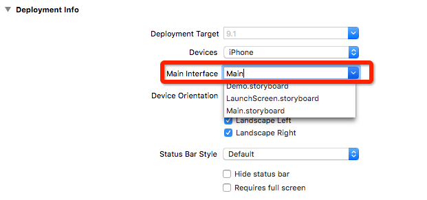
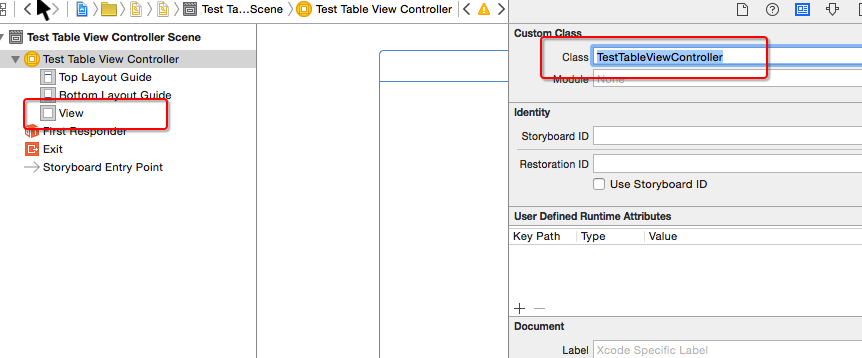
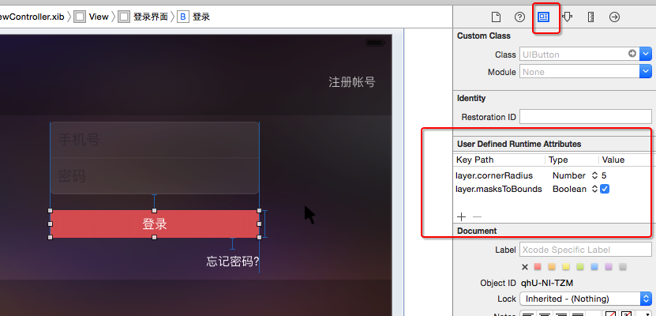

#Chapter-01 MISSAJJ琴瑟静听IOS项目开发笔记
---
```objc
Update更新：2016年5月20日 By {MISSAJJ琴瑟静听}
```
##项目的常见属性


- Product Name
  - 产品名称
  - 项目名称
  - 软件名称
- Organization Name
  - 公司名称
- Organization Identifier
 - 公司的唯一标识
 - 一般用网站域名的反写形式
- Bundle Identifier
 - 软件的唯一标识
 - 默认 == Organization Identifier + Product Name

##Xcode快捷键
- 调出代码:command+option+Enter 
- 退出代码:command+Enter  
- .h 件和.m 件切换:control+command+上下键 

##不同的屏幕的尺寸,代表的点坐标系 
- 3.5 : 320x480
- 4.0 : 320x568
- 4.7 : 375x667 
- 5.5 : 414x736

 
##项目的图片资源
- 可以利用一个Mac软件解压
 - https://github.com/devcxm/iOS-Images-Extractor


##storyboard文件的认识
- 作用：描述软件界面
- 程序启动的简单过程
  - 程序一启动，就会加载Main.storyboard文件
  - 会创建箭头所指的控制器，并且显示控制器所管理的软件界面

## Xcode插件的安装路径
```objc
/Users/用户名/Library/Application Support/Developer/Shared/Xcode/Plug-ins
```

##IOS项目的启动过程 
创建项目的时候系统会默认创建一个Main.storyboard文件，当项目启动时会自动加载这个storyboard,当然我们也可以自己创建并决定使用哪个storyboard文件:

选中项目—>General—>Main Interface->选择加载storyboard

 
storyboard内可以添加多个控制器，但项目启动的时候加载哪一个控制器可以这样设置:

选中storyboard—>如果没有VC控制器就自己拖入一个—>选中控制器—>右侧第三个按钮(Attributes)—>is Initial View Controller （打钩）


##控制器

   -  概念：凡是继承自UIViewController的对象，都叫做控制器
   -  注意：每一个控制器都会专门管理一个软件界面
   -  作用：负责处理软件界面的各种事件、负责软件界面的创建和销毁

##IBAction

- 只能修饰方法的返回值类型
- 被IBAction修饰的方法
  - 能拖线到storyboard中
  - 返回值类型实际是void


- 使用格式

```objc
-(IBAction)buttonClick
{

}
```
##IBOutlet 

- 只能修饰属性
- 被IBOutlet修饰的属性
  - 能拖线到storyboard中
  
  
- 使用格式

```objc
@property (nonatomic, weak) IBOutlet UILabel *label;
```
##关于IBAction、IBOutlet前缀IB的解释

- 全称：Interface Builder
- 以前的UI界面开发模式：Xcode3 + Interface Builder
- 从Xcode4开始，Interface Builder已经整合到Xcode中了

##常见错误


- 第1个错误
 - 错误描述：
```objc
        [<ViewController 0x7fdc0152d300> setValue:forUndefinedKey:]: 
        this class is not key value coding-compliant for the key label.
```
        
 - 原因：IBOutlet属性代码被删掉了，但是属性连线还在
 - 解决：将残留的连线删掉
 

- 第2个错误
 - 错误描述：
 
 ```objc
 -[ViewController blueClick]: unrecognized selector sent to instance 0x7ff59d014320
```

 - 原因：调用了一个不存在的方法
 - 解决：认真检查方法名，使用正确并且存在的方法名

##类扩展(Class Extension)

- 作用
  - 能为某个类增加额外的属性、成员变量、方法声明
  - 一般将类扩展写到.m文件中
  - 一般将一些私有的属性写到类扩展


- 使用格式

```objc
@interface 类名()
/* 属性、成员变量、方法声明 */
@end

```
 
- 与分类的区别

 - 分类的小括号必须有名字
 - 分类只能扩充方法
 - 如果在分类中声明了一个属性，分类只会生成这个属性的get\set方法声明

```objc
@interface 类名(分类名字)
/* 方法声明 */
@end

@implementation 类名(分类名字)
/* 方法实现 */
@end
```

  
## 应用程序的图标
- 旧项目中的图标只要符合1个条件即可
 - 图片名叫做Icon.png

## 从iOS9开始的常见报错
```objc
Application windows are expected to
have a root view controller 
at the end of application launch
```
- 从iOS9开始, 在`程序启动完毕那一刻`显示出来的窗口`必须`要设置`根控制器`

## 有些图片显示出来会自动渲染成蓝色
#### 比如
- 设置tabBarItem的选中图片

```objc
vc.tabBarItem.selectedImage = image;
```

- 设置UIButtonTypeSystem样式按钮的image时

```objc
UIButton *btn = [UIButton buttonWithType:UIButtonTypeSystem];
[btn setImage:image forState:UIControlStateNormal];
```

#### 解决方案
- 再次产生一张不会进行渲染的图片

```objc
// 加载图片
UIImage *tempImage = [UIImage imageNamed:@"tabBar_essence_click_icon"];
// 产生一张不会进行自动渲染的图片
UIImage *selectedImage = [tempImage imageWithRenderingMode:UIImageRenderingModeAlwaysOriginal];
vc.tabBarItem.selectedImage = selectedImage;
```

- 直接在xcassets文件中配置


## 设置TabBarItem的文字属性
- 直接设置每一个tabBarItem对象

```objc
// 普通状态下的文字属性
NSMutableDictionary *normalAttrs = [NSMutableDictionary dictionary];
normalAttrs[NSFontAttributeName] = [UIFont systemFontOfSize:14];
normalAttrs[NSForegroundColorAttributeName] = [UIColor grayColor];
[vc.tabBarItem setTitleTextAttributes:normalAttrs forState:UIControlStateNormal];

// 选中状态下的文字属性
NSMutableDictionary *selectedAttrs = [NSMutableDictionary dictionary];
selectedAttrs[NSForegroundColorAttributeName] = [UIColor darkGrayColor];
[vc.tabBarItem setTitleTextAttributes:selectedAttrs forState:UIControlStateSelected];

// 字典中用到的key
1.iOS7之前(在UIStringDrawing.h中可以找到)
- 比如UITextAttributeFont\UITextAttributeTextColor
- 规律:UITextAttributeXXX

2.iOS7开始(在NSAttributedString.h中可以找到)
- 比如NSFontAttributeName\NSForegroundColorAttributeName
- 规律:NSXXXAttributeName
```

- 通过UITabBarItem的appearance对象统一设置

```objc
/**** 设置所有UITabBarItem的文字属性 ****/
UITabBarItem *item = [UITabBarItem appearance];
// 普通状态下的文字属性
NSMutableDictionary *normalAttrs = [NSMutableDictionary dictionary];
normalAttrs[NSFontAttributeName] = [UIFont systemFontOfSize:14];
normalAttrs[NSForegroundColorAttributeName] = [UIColor grayColor];
[item setTitleTextAttributes:normalAttrs forState:UIControlStateNormal];
// 选中状态下的文字属性
NSMutableDictionary *selectedAttrs = [NSMutableDictionary dictionary];
selectedAttrs[NSForegroundColorAttributeName] = [UIColor darkGrayColor];
[item setTitleTextAttributes:normalAttrs forState:UIControlStateSelected];
```


## Appearance的使用场合
- 只要后面带有`UI_APPEARANCE_SELECTOR`的方法或者属性,都可以通过appearance对象统一设置
- 比如

```objc
@interface UISwitch : UIControl <NSCoding>

@property(nullable, nonatomic, strong) UIColor *onTintColor NS_AVAILABLE_IOS(5_0) UI_APPEARANCE_SELECTOR;

@end

UISwitch *s = [UISwitch appearance];
s.onTintColor = [UIColor redColor];
```
## 控制台可能会输出以下警告信息
- 警告的原因: [UIImage imageNamed:nil]
```objc
CUICatalog: Invalid asset name supplied: (null)
CUICatalog: Invalid asset name supplied: (null)
```

- 警告的原因: [UIImage imageNamed:@""]
```objc
CUICatalog: Invalid asset name supplied:
CUICatalog: Invalid asset name supplied:
```


## 替换UITabBarController内部的tabBar
```objc
// 这里的self是UITabBarController
[self setValue:[[XMGTabBar alloc] init] forKeyPath:@"tabBar"];
```


## 按钮常见的访问方法
```objc
[button imageForState:UIControlStateNormal].size;
button.currentImage.size;

[button backgroundImageForState:UIControlStateNormal];
button.currentBackgroundImage;

[button titleForState:UIControlStateNormal];
button.currentTitle;

[button titleColorForState:UIControlStateNormal];
button.currentTitleColor;
```

## 设置按钮的内边距
```objc
@property(nonatomic) UIEdgeInsets contentEdgeInsets UI_APPEARANCE_SELECTOR;
@property(nonatomic) UIEdgeInsets titleEdgeInsets;
@property(nonatomic) UIEdgeInsets imageEdgeInsets;
```

## 解决导航控制器pop手势失效
```
self.interactivePopGestureRecognizer.delegate = self;

- (BOOL)gestureRecognizerShouldBegin:(UIGestureRecognizer *)gestureRecognizer
{
    // 手势何时有效 : 当导航控制器的子控制器个数 > 1就有效
    return self.childViewControllers.count > 1;
}
```


## 在使用UITableViewController过程中,可能会出现的错误
```obj
@interface TestTableViewController : UITableViewController

@end

'-[UITableViewController loadView] instantiated view controller with identifier "UIViewController-BYZ-38-t0r" from storyboard "Main", but didn't get a UITableView.'
```
- 造成这个错误的原因
    - 错误地将一个UIViewController当做UITableViewController来用
- 错误做法



- 正确做法


## contentInset的调整
- 默认情况下, 如果一个控制器A处在导航控制器管理中, 并且控制器A的第一个子控件是UIScrollView, 那么就会自动调整这个UIScrollView的contentInset
    - UIEdgeInsetsMake(64, 0, 0, 0) // 有导航栏
    - UIEdgeInsetsMake(20, 0, 0, 0) // 没有导航栏
- 默认情况下, 如果一个控制器A处在导航控制器管理中, 并且导航控制器又处在UITabBarController管理中, 并且控制器A的第一个子控件是UIScrollView, 那么就会自动调整这个UIScrollView的contentInset
    - UIEdgeInsetsMake(64, 0, 49, 0)
- 如何禁止上述的默认问题?

```objc
控制器A.automaticallyAdjustsScrollViewInsets = NO;
```

## 文字内容换行
- 如何让storyboard\xib中的文字内容换行
    - 快捷键: option + 回车键
    - 在storyboard\xib输入\n是无法实现换行的
- 在代码中输入\n是可以实现换行的

```objc
self.label.text = @"534534534\n5345345\n5345";
```

## 修改状态栏样式
- 使用UIApplication来管理

```objc
[[UIApplication sharedApplication] setStatusBarStyle:UIStatusBarStyleLightContent];
```
在Info.plist中做了图中的配置,可能会出现以下警告信息


- 使用UIViewController来管理

```objc
@implementation XMGLoginRegisterViewController
- (UIStatusBarStyle)preferredStatusBarStyle
{
    return UIStatusBarStyleLightContent;
}
@end
```

## 在xib\storyboard中使用KVC



## 枚举值的某个规律
- 凡是使用了1 << n格式的枚举值, 都可以使用|进行组合使用

```objc
UIControlEventEditingDidBegin                                   = 1 << 16,
UIControlEventEditingChanged                                    = 1 << 17,
UIControlEventEditingDidEnd                                     = 1 << 18,
UIControlEventEditingDidEndOnExit                               = 1 << 19,

[textField addTarget:self action:@selector(test) forControlEvents:UIControlEventEditingDidBegin | UIControlEventEditingChanged];
```

## 通知相关的补充
### 使用block监听通知
```obj
// object对象发出了名字为name的通知, 就在queue队列中执行block
self.observer = [[NSNotificationCenter defaultCenter] addObserverForName:UITextFieldTextDidBeginEditingNotification object:self queue:[[NSOperationQueue alloc] init] usingBlock:^(NSNotification * _Nonnull note) {
    // 一旦监听到通知, 就会执行这个block中的代码
}];

// 最后需要移除监听
[[NSNotificationCenter defaultCenter] removeObserver:self.observer];
```

### 一次性通知(监听1次后就不再监听)
```objc
id observer = [[NSNotificationCenter defaultCenter] addObserverForName:UITextFieldTextDidBeginEditingNotification object:self queue:[[NSOperationQueue alloc] init] usingBlock:^(NSNotification * _Nonnull note) {


    // 移除通知
    [[NSNotificationCenter defaultCenter] removeObserver:observer];
}];
```

### 其他
- 如果在线程A发出通知，那么就会在线程A中接收通知

```objc
dispatch_async(dispatch_get_global_queue(0, 0), ^{
    // 系统会在子线程中处理test这个通知
    [[NSNotificationCenter defaultCenter] postNotificationName:@"test" object:nil];
});
```


## 利用SDWebImage设置UIButton的图片
- 正确用法

```objc
[button sd_setImageWithURL:[NSURL URLWithString:url] forState:UIControlStateNormal placeholderImage:image];
```

## 解决tableView设置tableFooterView时contentSize不正确的问题
```objc
tableView.tableFooterView = footerView;
// 重新刷新数据(会重新计算contentSize)
[tableView reloadData];
```

## 查找字符串的常见方法
```objc
// 如果range.location == 0, 说明是以searchString开头
// 如果range.location == NSNotFound或者range.length == 0, 说明没找到对应的字符串
- (NSRange)rangeOfString:(NSString *)searchString;
// 是否以str开头
- (BOOL)hasPrefix:(NSString *)str;
// 是否以str结尾
- (BOOL)hasSuffix:(NSString *)str;
// 是否包含了str(不管头部\中间\尾部)
- (BOOL)containsString:(NSString *)str;
```


## viewWithTag:内部的大致实现思路
```objc
@implementation UIView
- (UIView *)viewWithTag:(NSInteger)tag
{
    if (self.tag == tag) return self;

    for (UIView *subview in self.subviews) {
        return [subview viewWithTag:tag];
    }
}
@end
```
## addObject:和addObjectsFromArray:的区别
```objc
self.topics = @[20, 19, 18]
moreTopics = @[17, 16, 15]

self.topics = @[20, 19, 18, @[17, 16, 15]]
[self.topics addObject:moreTopics];

self.topics = @[20, 19, 18, 17, 16, 15]
[self.topics addObjectsFromArray:moreTopics];
```

## 服务器分页的做法
```objc
服务器数据库的数据 = @[23, 22, 21, 20, 19, 18, 17, 16, 15, 14, 13, 12, 11, 10]


第1页数据 == @[20, 19, 18, 17, 16]

做法1:
发送page参数 : page=2
第2页数据 == @[18, 17, 16, 15, 14]

做法2:
发送maxid参数 : maxid=16
第2页数据 == @[15, 14, 13, 12, 11]
```

## 集成MJRefresh
- [github](https://github.com/CoderMJLee/MJRefresh)
- 基本用法

```objc
self.tableView.mj_header = [MJRefreshNormalHeader headerWithRefreshingTarget:self refreshingAction:@selector(loadNewTopics)];
[self.tableView.mj_header beginRefreshing];

self.tableView.mj_footer = [MJRefreshAutoNormalFooter footerWithRefreshingTarget:self refreshingAction:@selector(loadMoreTopics)];
```

## 利用AFN取消请求
```objc
// 取消所有请求
for (NSURLSessionTask *task in self.manager.tasks) {
    [task cancel];
}

// 取消所有请求
[self.manager.tasks makeObjectsPerformSelector:@selector(cancel)];

// 关闭NSURLSession + 取消所有请求
// NSURLSession一旦被关闭了, 就不能再发请求
[self.manager invalidateSessionCancelingTasks:YES];

// 注意: 一个请求任务被取消了(cancel), 会自动调用AFN请求的failure这个block, block中传入error参数的code是NSURLErrorCancelled
```


## 自动拉伸问题
- 从xib中加载进来的控件的`autoresizingMask`属性值默认是
    - `UIViewAutoresizingFlexibleWidth | UIViewAutoresizingFlexibleHeight`
- 如果一个控件显示出来的大小和当初设置的frame大小不一致,有可能是因为`autoresizingMask`属性值包含了`UIViewAutoresizingFlexibleWidth | UIViewAutoresizingFlexibleHeight`,解决方案

```objc
控件.autoresizingMask = UIViewAutoresizingNone;
```
## 属性名注意点
- 对象属性名不能以new开头
```objc
@property (nonatomic, strong) NSMutableArray<XMGComment *> *newComments;
```

## 常见错误
```objc
-[__NSArray0 objectForKeyedSubscript:]: unrecognized selector sent to instance 0x7fb738c01870
// 错误地将NSArray当做NSDictionary来使用了
```

## block细节
- 如果【block内部】使用【外部声明的强引用】访问【对象A】, 那么【block内部】会自动产生一个【强引用】指向【对象A】
- 如果【block内部】使用【外部声明的弱引用】访问【对象A】, 那么【block内部】会自动产生一个【弱引用】指向【对象A】


