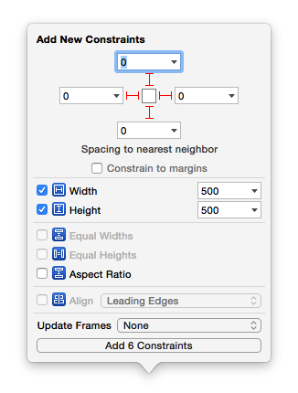
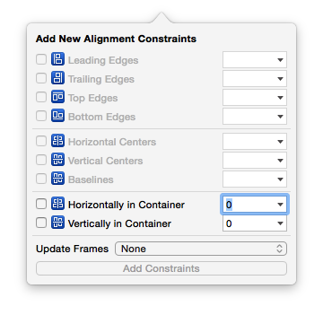

#Chapter-10 在XIB中设置UIScrollView
---
```objc
Update更新：2016年5月9日 By {MISSAJJ琴瑟静听}
```

## 在storyboard\xib中给UIScrollView子控件添加约束
- 给添加一个UIView类型的子控件A(这将是UIScrollView唯一的一个子控件)
- 设置A距离UIScrollView上下左右间距都为0
- 往A中再添加其他子控件


- 上下滚动(垂直滚动)
    - 设置A的高度(这个高度就是UIScrollView的内容高度: contentSize.height)

    
    - 设置A在UIScrollView中左右居中(水平居中)

    
- 左右滚动(水平滚动)
    - 设置A的宽度(这个宽度就是UIScrollView的内容宽度: contentSize.width)

    
    - 设置A在UIScrollView中上下居中(垂直居中)

    
- 上下左右滚动(水平垂直滚动)
    - 设置A的宽度(这个宽度就是UIScrollView的内容宽度: contentSize.width)
    - 设置A的高度(这个高度就是UIScrollView的内容高度: contentSize.height)

    
    
