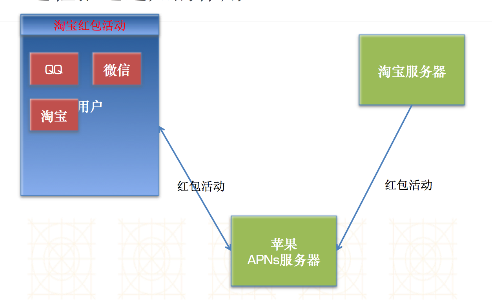
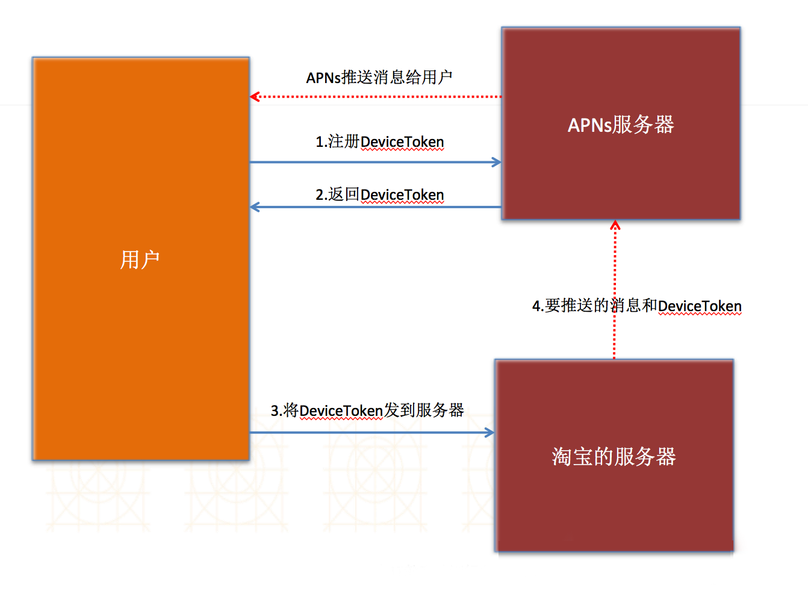
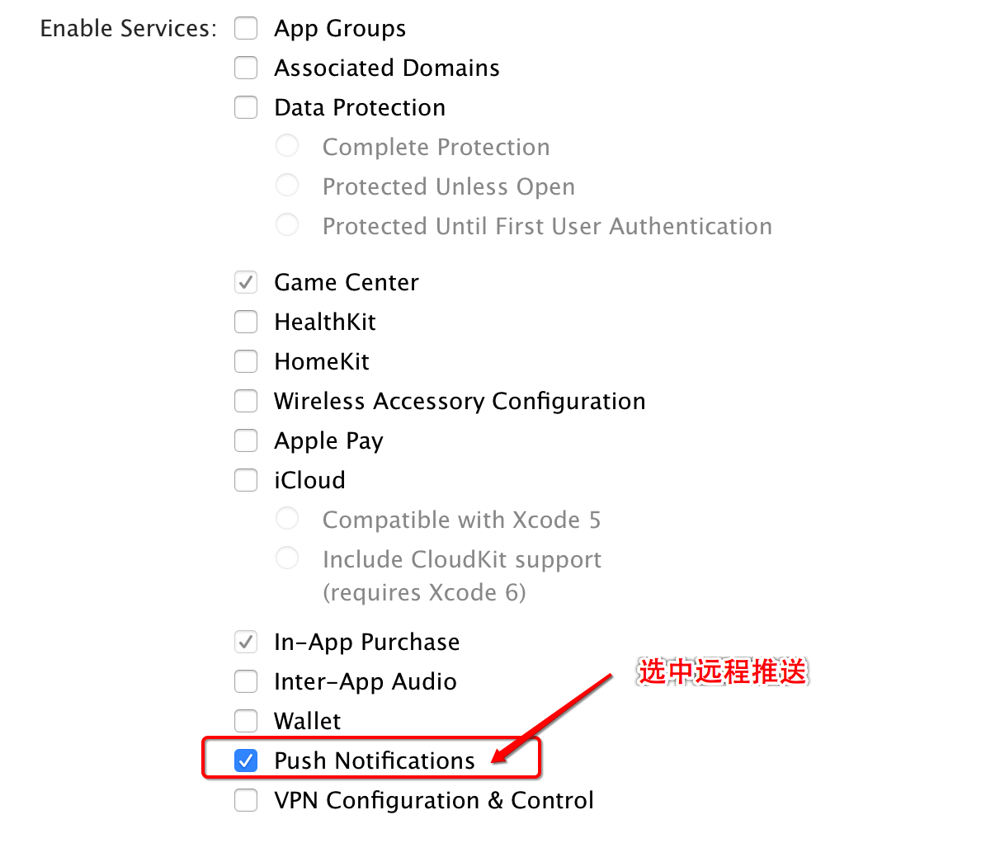
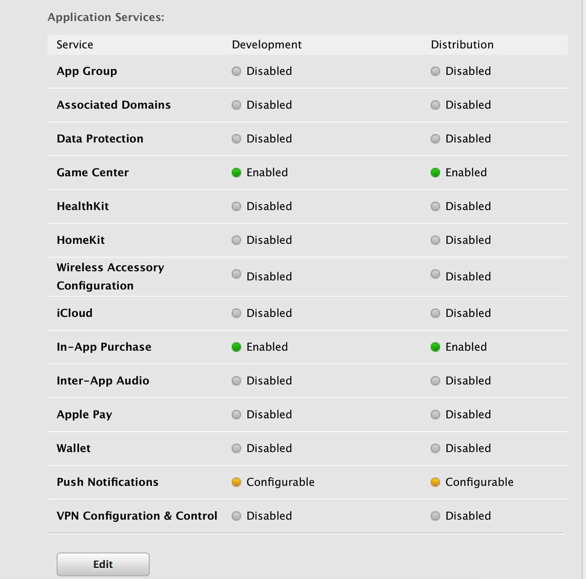
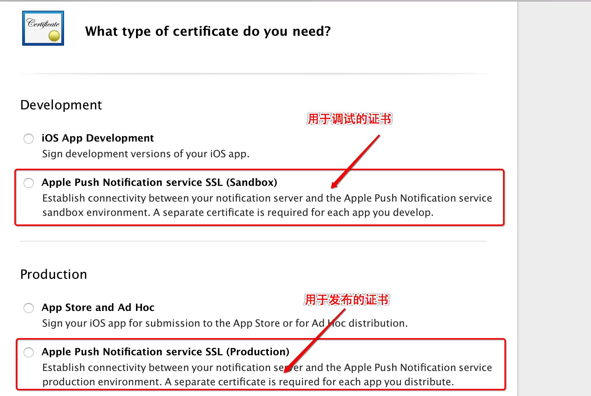
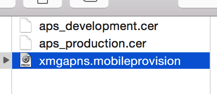

 
#推送通知的介绍
---
###什么是推送通知?

- 注意：这里说的推送通知跟NSNotification有所区别
 - NSNotification是抽象的，不可见的
 - 推送通知是可见的（能用肉眼看到）
- 作用:让不在前台(后台或者关闭)的APP知道APP内部发生的事情
- 通知的分类
 - 本地通知
   - 概念:由APP本身给应用程序推送消息,不需要服务器的支持
   - 常见场景:记账软件定时提醒记账/番茄工作法中提醒你时间等等
   - 注意:不是非常常用.
   
 - 远程通知
   - 概念:由服务器推送消息给用户,需要服务器的支持
   - 常见场景:微信提醒新消息/淘宝提醒有新活动/视频软件提供您有最新电影
   - 注意:非常常用.但是如果仅仅是给用户提醒,客户端(你)做的事情就非常简单.

- 推送通知的呈现样式(了解)
   - 在屏幕顶部显示一块横幅
    

   - 在屏幕中间弹出一个UIAlertView
   

   - 锁屏界面也可以显示
   

   - 收到通知时,同时播放音效.
   - 收到通知时,改变APP图标上的数字

###本地通知
####一.本地通知的介绍

- 直接由应用程序(程序中写入对应代码)给用户发出通知
- 本地通知需要用到一个重要的类:UILocalNotification
- 本地通知的实现步骤
 - 创建本地通知
 - 设置本地通知要发出的内容等信息
   - 发出时间
   - 发出内容
   - 播放的音效
 - 调度本地通知

####二.实现本地通知

#####1.注册通知

- iOS8之后,如果想要发出通知(无论本地还是远程),必须先进行注册.(iOS8之前不需要)
- 通常是在didFinishLaunchingWithOptions中进行注册
- 代码如下:
```
UIUserNotificationSettings *settings = [UIUserNotificationSettings settingsForTypes:UIUserNotificationTypeBadge | UIUserNotificationTypeSound | UIUserNotificationTypeAlert categories:nil];
[application registerUserNotificationSettings:settings];
```

#####2.创建并且发出通知

- 创建本地通知
```
    UILocalNotification *localNote = [[UILocalNotification alloc] init];
```
- 设置本地通知的内容
```
      // 2.设置本地通知的信息
      // 2.1.设置提示信息
      localNote.alertBody = @"吃饭了吗?";
      // 2.2.设置通知弹出的时间
      localNote.fireDate = [NSDate dateWithTimeIntervalSinceNow:5.0];
      // 2.3.设置滑块显示的文字
      localNote.alertAction = @"快点";
      // 2.4.是否让上面的文字生效
      localNote.hasAction = NO;
      // 2.5.设置通知中心的标题
      localNote.alertTitle = @"小码哥哥";
      // 2.6.设置通知的声音
      localNote.soundName = @"buyao.wav";
      // 2.7.设置应用程序图标右上角的数字
      localNote.applicationIconBadgeNumber = 10;
```
- 调度本地通知(调度之后某个时刻会弹出通知)
```
      // 3.调度通知
      [[UIApplication sharedApplication] scheduleLocalNotification:localNote];
```

###监听本地通知的点击
####一. 为什么要监听本地通知的点击?

- 1.通知点击之后会发生什么事情?
  - 不管应用程序出于后台还是被杀死,点击通知都可以打开应用程序
- 2.什么情况下需要监听用户点击了通知(不常用)
  - 比如:当用点击通知时,进入到某一个固定界面

####二. 如何监听本地通知的点击

- 应用程序分很多种状态
  - 在前台
    - 如果在前台不需要进行页面跳转
  - 在后台
    - 点击应用时进行页面的跳转
  - 被杀死
    - 点击应用打开应用时,进行页面的跳转
- 该代码为应用程序在前台或者后台时的做法

```
 // 应用在前台时,也会收到该通知,这时不应该进行页面的跳转
- (void)application:(UIApplication *)application didReceiveLocalNotification:(UILocalNotification *)notification
{
    // 跳转到固定的界面
    if (application.applicationState == UIApplicationStateInactive) {
        // 进行页面的跳转
    } else {
        // 其他情况不需要跳转
    }
}
```
- 该代码为应用程序被杀死时的做法

```
- (BOOL)application:(UIApplication *)application didFinishLaunchingWithOptions:(NSDictionary *)launchOptions {
    // iOS8注册通知
    if ([UIDevice currentDevice].systemVersion.doubleValue >= 8.0) {
        UIUserNotificationSettings *settings = [UIUserNotificationSettings settingsForTypes:UIUserNotificationTypeBadge | UIUserNotificationTypeAlert | UIUserNotificationTypeSound categories:nil];
        [application registerUserNotificationSettings:settings];
    }

    // 判断是否是通过点击通知打开了应用程序
    if (launchOptions[UIApplicationLaunchOptionsLocalNotificationKey]) {
        // 跳转代码
    }

    return YES;
}
```

###远程通知
####一.什么是远程通知

- 概念:由服务器发送消息给用户弹出消息的通知(需要联网)
- 远程推送服务，又称为APNs（Apple Push Notification Services）

####二.为什么需要远程通知

- 例子:淘宝最近双11搞活动,各种送红包,想告知用户.但是该用户不经常打包淘宝APP.淘宝如何通知该用户有最新的活动呢?
- 传统方式:只有用户打开了淘宝客户端,客户端向服务器请求是否有最新的活动,才能在APP中告知用户活动.
- 局限性:只要用户关闭了app，就无法跟app的服务器沟通，无法从服务器上获得最新的数据内容
- 远程通知的好处:不管用户打开还是关闭app，只要联网了，都能接收到服务器推送的远程通知

####三.远程通知的原理

- 原理图

 

- 为什么淘宝服务器不直接推消息给用户?
  - 在通常情况下服务器端是不能主动向客户端推消息的.
  - 如果想服务器端给客户端推消息,必须建立长连接
  - 淘宝客户端在处于后台时不能和服务器端建立长连接
- 为什么苹果服务器可以推消息给用户?
  - 所有的苹果设备，在联网状态下，都会与苹果的服务器建立长连接
  - 苹果建立长连接的作用:
    - 时间校准
    - 系统升级提示
    - 查找我的iPhone
    - 远程通知
    - ...
- 疑惑:苹果在推送消息时,如何准确的推送给某一个用户,并且知道是哪一个APP?
  - 在淘宝服务器把消息给苹果的APNs服务器时,必须告知苹果DeviceToken
  - 什么是DeviceToken?
    - DeviceToken是由用户手机的UDID和应用程序的BundleID共同生成的
    - 通过DeviceToken可以找到唯一手机中的唯一应用程序
  - 如何获得DeviceToken?
    - 客户端到苹果的APNs注册即可获得.
- 完整的流程图


####四.如何做远程通知

- 首先,BundleID对应的APPID必须是明确的(特殊功能)
- 该APPID必须配置两个证书
  - 开发证书:用于调试远程推送
  - 发布证书:用于发布后给用户推送消息
- 根据上面的APPID重新配置描述文件
- 安装对应的证书,即可开始测试远程推送


###远程通知证书配置
####一.配置一个明确的APPID

- 选择明确的APPID,并且将远程通知功能选中



- 显示Push Notifications并非Enabled,而是Configurable.


 - 需要配置对应的证书

####二.证书的配置

- 在Certificates中配置证书
 - 选择证书的类型(调试和发布都需要配置)
 
 - 选择为哪一个APPID配置证书


 - 其他步骤同真机调试和发布程序
 - 配置完成后获得两个证书文件


 - 回到APPID处,已经变成了enabled

- 配置描述文件
 - 和真机描述文件完全一致


