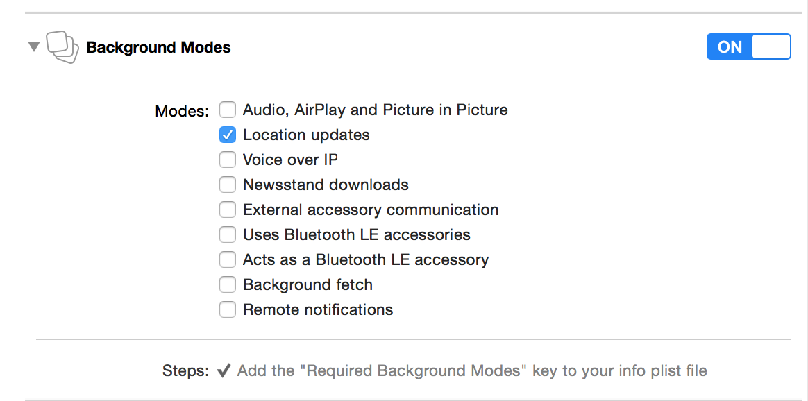

#Chapter-19 地图定位CoreLocation框架


 
###一.IOS8.0之前的定位
####1.前台定位

- 导入CoreLocation框架以及对应的主头文件
```
     #import <CoreLocation/CoreLocation.h>
```
- 创建CLLocationManager对象并设置代理
```
     self.locationM = [[CLLocationManager alloc] init];
     self.locationM.delegate = self;
```
- 调用方法,开始更新用户位置信息
```
     [self.locationM startUpdatingLocation];
```
- 在对应的代理方法中获取位置信息
```
     -(void)locationManager:(nonnull CLLocationManager *)manager didUpdateLocations:(nonnull NSArray<CLLocation > *)locations  
     {
         NSLog(@"每当请求到位置信息时, 都会调用此方法");  
     }
```
####2.后台定位

- 在前台定位基础上, 勾选后台模式Location updates image



####3.额外设置

- 每隔多少米定位一次
```
代码: self.locationM.distanceFilter = 100;
功能: 只有当最新的位置与上一次获取的位置之间的距离, 大于这个值时, 才会通过代理告诉外界
```
- 设置定位精确度
```
     代   码: self.locationM.desiredAccuracy = kCLLocationAccuracyBest;
     功   能: 通过设置此属性, 获取不同精确度的位置信息
     注意事项: 精确度越高，越耗电，定位所需时间越长
     枚举注解:   
```

| 枚举值 | 含义 |
| -- | -- |
| kCLLocationAccuracyBestForNavigation | 最适合导航 |
| kCLLocationAccuracyBest | 精度最好的 |
| kCLLocationAccuracyNearestTenMeters | 附近10米 |
| kCLLocationAccuracyHundredMeters | 附近100米 |
| kCLLocationAccuracyKilometer | 附近1000米 |
| kCLLocationAccuracyThreeKilometers | 附近3000米 |

 
###3.知识补充
```
1. 定位常识
    1) 标准定位服务(基于gps/基站/wifi定位, 具体使用哪种,苹果有自己规则) 
        > 程序关闭,就没法获取位置 
    2) 显著的位置变化定位服务(使用基站进行定位,所以必须要求设备有电话模块) 
        > 当app被完全关闭时,也可以接收到位置通知,并让app进入到后台处理 
        > 定位精度相比于上面,精度不大,所以耗电小,而且定位更新频率依据基站密度而定 

2. 应用场景
    1) 如果要求定位及时,精度较高,并且运行时间较短,可使用标准定位; 
    2) 如果长时间监控用户位置,用户移动速度比较快(例如打车软件),可使用后者 
```
###4.测试环境:
```
1. XCode7.0之前版本,例如XCode6.4版本
2. 模拟器选择iOS8.0之前的版本
    * 原因 : XCode7.0(包含7.0)之后不支持iOS8.0之前的模拟器
```
###5.常见问题总结
```
    定位不到, 对应的代理方法不执行:
    首先,检查运行的模拟器是否是iOS8.0之前的系统版本
    其次,检查模拟器是否设置位置数据
    第三,确保代码无问题(一般都是代理没有设置,或者位置管理器对象是局部变量,亦或是位置管理器对象没有被强引用)
    第四,绝逼是模拟器BUG, 请重置模拟器(是重置,不是重启)
```
###二. iOS8.0之后定位
####1. 前台定位

- 导入CoreLocation框架以及对应的主头文件
```
     #import <CoreLocation/CoreLocation.h>
```
- 创建CLLocationManager对象并设置代理
```
     self.locationM = [[CLLocationManager alloc] init];
     self.locationM.delegate = self;
```
- 请求前台定位授权, 并在Info.Plist文件中配置Key ( Nslocationwheninuseusagedescription )
```
     [self.locationM requestWhenInUseAuthorization];
```
- 调用方法,开始更新用户位置信息
```
     [self.locationM startUpdatingLocation];
```
- 在对应的代理方法中获取位置信息
```
     -(void)locationManager:(nonnull CLLocationManager *)manager didUpdateLocations:(nonnull NSArray<CLLocation > *)locations  
     {
         NSLog(@"每当请求到位置信息时, 都会调用此方法");  
     }
```
####2. 后台定位
#####方案一:

    在前台定位基础上, 勾选后台模式Location updates 
    
  

**注意:此时授权状态如果是前台定位, 那么当APP退到后台时, 屏幕顶部会出现蓝条**

#####方案二:

- 请求前后台定位授权,并在info.plist文件中配置KEY ( NSLocationAlwaysUsageDescription )
```
     [self.locationM requestAlwaysAuthorization];
```
- 注意:不需要勾选后台模式, 也可以进行后台定位

- 注意:此时授权状态如果是前后台定位, 那么即使APP退到后台时, 屏幕顶部会也不会出现蓝条

####3. 监听用户授权状态

- 实现以下代理方法即可
```
     // 当用户授权状态发生变化时调用
     -(void)locationManager:(nonnull CLLocationManager *)manager didChangeAuthorizationStatus:(CLAuthorizationStatus)status
     {
     switch (status) {
     // 用户还未决定
     case kCLAuthorizationStatusNotDetermined:
     {
         NSLog(@"用户还未决定");
         break;
     }
     // 访问受限(苹果预留选项,暂时没用)
     case kCLAuthorizationStatusRestricted:
     {
         NSLog(@"访问受限");
         break;
     }
     // 定位关闭时和对此APP授权为never时调用
     case kCLAuthorizationStatusDenied:
     {
         // 定位是否可用（是否支持定位或者定位是否开启）
         if([CLLocationManager locationServicesEnabled])
         {
             NSLog(@"定位开启，但被拒");
             // 在此处, 应该提醒用户给此应用授权, 并跳转到"设置"界面让用户进行授权
             // 在iOS8.0之后跳转到"设置"界面代码
             NSURL *settingURL = [NSURL URLWithString:UIApplicationOpenSettingsURLString];
             if([[UIApplication sharedApplication] canOpenURL:settingURL])
             {
                 [[UIApplication sharedApplication] openURL:settingURL];
             }
         }else
         {
             NSLog(@"定位关闭，不可用");
         }
         break;
     }
         // 获取前后台定位授权
     case kCLAuthorizationStatusAuthorizedAlways:
     //  case kCLAuthorizationStatusAuthorized: // 失效，不建议使用
     {
         NSLog(@"获取前后台定位授权");
         break;
     }
         // 获得前台定位授权
     case kCLAuthorizationStatusAuthorizedWhenInUse:
     {
         NSLog(@"获得前台定位授权");
         break;
     }
     default:
         break;
     }
     }
```
####4. 测试环境:

```
1. XCode版本无要求
2. 模拟器选择iOS8.0之后的版本
```

####5. 常见问题总结

```
    定位不到, 对应的代理方法不执行:
    首先,检查是否请求授权, 并设置了对应的KEY
    其次,检查模拟器是否设置位置数据
    第三,确保代码无问题(一般都是代理没有设置,或者位置管理器对象是局部变量,亦或是位置管理器对象没有被强引用)
    第四,绝逼是模拟器BUG, 请重置模拟器(是重置,不是重启)
```
###三. iOS9.0 定位补充
####1. 定位变化
- 前台定位
```
    (同iOS8.0之后一致, 无任何变化, 都需要主动请求授权)
```
- 后台定位

#####方案一:

    在前台定位基础上, 勾选后台模式Location updates, 并且设置以下属性为YES
```
     if ([[UIDevice currentDevice].systemVersion floatValue] >= 9.0)
      {
          self.locationM.allowsBackgroundLocationUpdates = YES;
      }
```
#####方案二:

    请求前后台定位授权,并在info.plist文件中配置KEY ( NSLocationAlwaysUsageDescription )
```
     [self.locationM requestAlwaysAuthorization];
```
####2. 新的API

- 单次定位请求;
```
     代   码: [self.locationM requestAlwaysAuthorization];
     功   能: 获取一次位置信息
     实现逻辑: 
         (1) 按照定位精确度从低到高进行排序，逐个进行定位.如果在有效时间内, 定位到了精确度最好的位置, 那么就把对应的位置通过代理告知外界.
         (2) 如果获取到的位置不是精确度最高的那个，也会在定位超时后，通过代理告诉外界.
     注意事项: 
         (1) 必须实现代理的-locationManager:didFailWithError:方法
         (2) 不能与startUpdatingLocation方法同时使用
```

####3. 测试环境:

```
1. XCode版本要求7.0版本以上
2. 模拟器选择iOS9.0之后的版本
```

####4. 常见问题总结
```
    单次定位在模拟器上测试不出效果?
    答: 因为模拟器的位置是固定的, 所以无法测试出效果, 请使用真机进行测试.
```
###四. CLLocation对象详解
####1. 属性解释
```
    > coordinate    : 当前位置所在的经纬度数据
    > altitude      : 海拔
    > speed         : 当前速度
    > course        : 航向(设备移动的方向, 值域范围:0.0 ~ 259.9, 正北方向为0.0)
```

####2. 重要方法
```
    代码: - (CLLocationDistance)distanceFromLocation:(CLLocation *)location
    作用: 计算两个位置对象之间的物理距离, 单位是(米)
```
####3. 场景演练
```
1. 场景演示:打印当前用户的行走方向,偏离角度以及对应的行走距离,
    例如:”北偏东30度方向,移动了8米”
2. 实现步骤: 
    1> 获取对应的方向偏向(例如”正东”,”东偏南”)
    2> 获取对应的偏离角度(并判断是否是正方向)
    3> 计算行走距离
    4> 打印信息
```
####4. 注意事项
```
    使用位置前, 务必判断当前获取的位置是否有效

     代码: if (location.horizontalAccuracy < 0) return;
     功能: 如果水平精确度小于零, 代表虽然可以获取位置对象, 但是数据错误, 不可用 
```

###五、经验小结


####一. 定位的应用场景
```
    1) 导航 
    2) 电商APP,获取用户所在城市(需要与(反)地理编码联合使用) 
    3) 数据采集用户信息(例如,统计app使用分布)
    4) 查找周边(周边好友, 周边商家等等)
 ```   
####二. 开发经验
```
由于定位非常耗电; 所以为了给用户省电, 你可以遵守以下小经验

    1）不需要获取用户位置时,一定要关闭定位服务：
    2）如果能满足项目需求,尽可能的使用”监听显著位置变化”的定位服务(打车app)
    3）如果可以,尽可能使用低精度的desiredAccuracy
    4）如果是数据采集,(一般都是周期性的去轮询用户位置),在轮询期间一定要关闭定位
```
###五. 指南针效果实现
####1. 实现思路
```
    利用"磁力计"传感器,获取设备朝向
    根据设备朝向反向旋转"指南针"图片
```
####2. 代码实现

- 获取设备朝向
```
     1) 导入CoreLocation框架以及对应的主头文件
         #import <CoreLocation/CoreLocation.h>

     2) 创建CLLocationManager对象并设置代理
         self.locationM = [[CLLocationManager alloc] init];
         self.locationM.delegate = self;

     3) 调用方法, 开始获取设备朝向
         [self.locationM startUpdatingHeading];

     4) 在对应的代理方法中获取设备朝向信息
         -(void)locationManager:(CLLocationManager *)manager didUpdateHeading:(CLHeading *)newHeading
         {
             // 旋转图片代码
         }
```

- 旋转图片
- 
```
     // 1.判断当前的角度是否有效(如果此值小于0,代表角度无效)
     if(newHeading.headingAccuracy < 0)
     return;

     // 2.获取当前设备朝向(磁北方向)
     CGFloat angle = newHeading.magneticHeading;

     // 3.转换成为弧度
     CGFloat radian = angle / 180.0 * M_PI;

     // 4.带动画反向旋转指南针
     [UIView animateWithDuration:0.5 animations:^{
         self.compassView.transform = CGAffineTransformMakeRotation(-radian);
     }];
```

####3. 概念补充
```
    磁北角度: newHeading.magneticHeading   ------- 相对于"磁北方向"产生的角度
    真北角度: newHeading.trueHeading           ------- 相对于"真北方向"产生的角度
```
####4. 注意事项

```
  1. 获取设备朝向前, 先判断"磁力计"是否可用
        [CLLocationManager headingAvailable];

    2. 获取朝向前, 判断当前朝向信息是否有效
        if(newHeading.headingAccuracy < 0) return;

    3. 注意与"航向"的区别
        设备朝向是指手机的朝向; "航向"可以理解为设备的移动方向

    4. 使用"磁力计"传感器获取设备朝向, 不需要请求用户授权
        因为设备朝向不涉及用户隐私
```

####5.测试环境

```
    1. XCode版本无要求(建议:XCode7.0不需要开发者账号也可以进行真机调试)
    2. 必须要求真机设备(只有真机设备才有"磁力计"传感器) 
```

###六.区域监听
####1.概念解释
```
    区   域 :  就是指划定的一块地域范围(比如圆形区域, 则由区域中心, 和半径组成)
    区域监听 : 是指,我们通过代码指定一个区域, 然后当用户持握设备进入或者离开指定区域, 我们都能监听到.
```
####2. 监听指定区域
 
- 导入CoreLocation框架以及对应的主头文件
```
     #import <CoreLocation/CoreLocation.h>
```

- 创建CLLocationManager对象并设置代理
```
     self.locationM = [[CLLocationManager alloc] init];
     self.locationM.delegate = self;
```

- 请求前后台定位, 或前台定位授权, 并在Info.Plist文件中配置相应的Key
```
     [self.locationM requestAlwaysAuthorization];
     // [self.locationM requestWhenInUseAuthorization]; 
```

- 创建一个区域, 并开始监听
```
     // 1. 判断区域监听服务是否可用(定位服务是否关闭, 定位是否授权, 是否开启飞行模式)
     if ([CLLocationManager isMonitoringAvailableForClass:[CLCircularRegion class]]) 
     {

         // 创建区域中心
         CLLocationCoordinate2D center = CLLocationCoordinate2DMake(29.12345, 131.23456);

         // 创建区域（指定区域中心，和区域半径）
         CLLocationDistance radius = 1000;

         // 判断区域半径是否大于最大监听区域半径,如果大于, 就没法监听
         if (radius > self.locationM.maximumRegionMonitoringDistance) {
             radius = self.locationM.maximumRegionMonitoringDistance;
         }
         CLCircularRegion *region = [[CLCircularRegion alloc] initWithCenter:center radius:radius identifier:@"小码哥"];

         // 开始监听指定区域
         [self.locationM startMonitoringForRegion:region];
     }
     else
     {
         NSLog(@"区域监听不可用");
     }
```

- 在对应的代理方法中监听区域状态
```
     // 进去监听区域后调用（调用一次）
     -(void)locationManager:(nonnull CLLocationManager *)manager didEnterRegion:(nonnull CLRegion *)region
     {
         NSLog(@"进入区域---%@", region.identifier);
         [manager stopMonitoringForRegion:region];
     }

     // 离开监听区域后调用（调用一次）
     -(void)locationManager:(nonnull CLLocationManager *)manager didExitRegion:(nonnull CLRegion *)region
     {
         NSLog(@"离开区域---%@", region.identifier);
     }
```

####3. 获取某个区域的当前状态

监听某个区域时, 只有进入或者离开这个区域时, 才能回调对应的方法, 是一个进入或者离开的动作 如果想知道某一个区域的当前状态(识别用户是在区域内部, 还是区域外部), 则需要使用以下方法
```
代   码:
    [self.locationM requestStateForRegion:region];
回调代理: 
    // 请求某个区域状态时, 回调的代理方法
    -(void)locationManager:(CLLocationManager *)manager didDetermineState:(CLRegionState)state forRegion:(CLRegion *)region
{
    switch (state) {
        case CLRegionStateUnknown:
            NSLog(@"未知状态");
            break;
        case CLRegionStateInside:
            NSLog(@"在区域内部");
            break;
        case CLRegionStateOutside:
            NSLog(@"在区域外部");
            break;
        default:
         break;
    }
}
```
####4. 测试环境

XCode版本无要求
iOS模拟器版本无要求

####5. 注意事项
```
1. 想要做区域监听, 在iOS8.0之后, 必须请求位置授权
   代码: [self.locationM requestAlwaysAuthorization];
   原因: 区域监听的原理就是获取用户的位置, 然后在判断该位置是否在制定区域内, 所以会涉及到用户隐私(位置), 而在iOS8.0之后, 想要访问用户位置信息, 就需要主动请求授权;

2. 使用前, 先判断区域监听是否可用
   代码:  [CLLocationManager isMonitoringAvailableForClass:[CLCircularRegion class]]

3. 注意区域半径是否大于最大区域监听半径(如果大于, 则无法监听成功)
   代码: radius > self.locationM.maximumRegionMonitoringDistance
```

####6. 常见问题
```
1. 区域监听, 测试没有效果?
   首先, 确定代码没有问题, 是否有请求授权;
   其次, 尝试修改模拟器位置信息, 触发进入区域或离开区域的动作
   第三, 如果模拟器出现BUG, 定位不到, 也会无法判定当前区域状态; 所以, 最后可以尝试重置模拟器.
```

###七. (反)地理编码
####1. 概念解释
```
地理编码:   是指根据地址关键字, 将其转换成为对应的经纬度等信息;
发地理编码:    是指根据经纬度信息, 将其转换成为对应的省市区街道等信息;
```
####2. 地理编码

- 导入CoreLocation框架以及对应的主头文件

```
     #import <CoreLocation/CoreLocation.h>
```

- 创建CLGeocoder对象
```
     self.geoC = [[CLGeocoder alloc] init];
```

- 根据地址关键字, 进行地理编码
```
     // 直接根据地址进行地理编码（返回结果可能有多个，因为一个地点有重名）
     [self.geoC geocodeAddressString:@"广州" completionHandler:^(NSArray<CLPlacemark *> * __nullable placemarks, NSError * __nullable error) 
     {
         // 包含区，街道等信息的地标对象
         CLPlacemark *placemark = [placemarks firstObject];
         // 城市名称
         NSString *city = placemark.locality;
         // 街道名称
         NSString *street = placemark.thoroughfare;
         // 全称
         NSString *name = placemark.name;
     }]; 
```

####3. 反地理编码

- 导入CoreLocation框架以及对应的主头文件
```
     #import <CoreLocation/CoreLocation.h>
```

- 创建CLGeocoder对象
```
     self.geoC = [[CLGeocoder alloc] init];
```

- 根据经纬度信息, 进行反地理编码
```
     // 根据经纬度信息进行反地理编码
     [self.geoC reverseGeocodeLocation:[[CLLocation alloc] initWithLatitude:21.123 longitude:123.345] completionHandler:^(NSArray<CLPlacemark *> * __nullable placemarks, NSError * __nullable error) 
     {
         // 包含区，街道等信息的地标对象
         CLPlacemark *placemark = [placemarks firstObject];
         // 城市名称
         NSString *city = placemark.locality;
         // 街道名称
         NSString *street = placemark.thoroughfare;
         // 全称
         NSString *name = placemark.name;
     }]; 
```

####4. CLPlacemark 地标对象详解
```
    location            : CLLocation 类型, 位置对象信息, 里面包含经纬度, 海拔等等
    region              : CLRegion 类型, 地标对象对应的区域
    addressDictionary  : NSDictionary 类型, 存放街道,省市等信息
    name                : NSString 类型, 地址全称
    thoroughfare        : NSString 类型, 街道名称
    locality            : NSString 类型, 城市名称
    administrativeArea : NSString 类型, 省名称
    country             : NSString 类型, 国家名称
```

5. 测试环境

*   必须联网
    XCode版本不限
    iOS模拟器系统版本不限

6. 常见问题

1. 测试无数据?
   首先, 检查是否有联网;
   其次, 如果是反地理编码,可尝试更换经纬度再次尝试, 有的经纬度没有对应信息

7. 应用场景

1. 一般与定位结合使用, 确定当前位置的具体地理信息

八. 使用第三方框架进行定位(✨✨)
1. 主要原因

    因为使用CoreLocation框架进行获取用户位置信息, 是通过代理进行回调; 而第三方框架将"代理模拟"转换成为"block模式"; 使用起来比较方便, 而且额外增加了超时时间等功能.

2. 框架信息

    名称: locationManager
    地址: [link](https://github.com/intuit/LocationManager)

3. 使用方法

    参照该框架对应的 readME

4. 注意事项

    一般集成第三方框架到项目中, 请先确保该框架没有问题, 然后再向项目中集成

九. 补充(✨✨✨)

    代理模式到block模式的转换

     主要思想就是,先记录下外界传递过来的block, 然后在对应的代理方法里面执行这个block;


