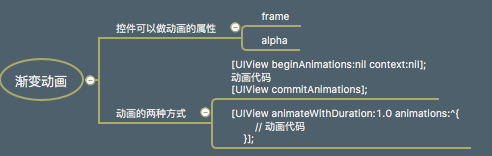

#Chapter-22 渐变动画UIViewAnimation的几种方法：位移，缩放，透明

---
```objc
Update更新：2016年5月22日 By {MISSAJJ琴瑟静听}
```

###渐变动画课程笔记思维导图：



###位移动画：改变控件的X，Y位置

- 1.方式一:步骤式方法(了解,不常用)


  ```objc 
  
 //步骤式代码：位移动画
    // 1.1.开始动画
    [UIView beginAnimations:nil context:nil];
    [UIView setAnimationDuration:1.0];
    
    // 1.2.动画执行的代码
    CGRect frame = self.orangeView.frame;
    frame.origin.y += 100;
    self.orangeView.frame = frame;
    
    // 1.3.提交动画
    [UIView commitAnimations];
```   
    
- 2.方式二:block方式 (掌握,常用)

 

  ```objc 
  //1,无block的位移动画方法
    [UIView animateWithDuration:0.5 animations:^{
        // 动画执行的代码
        CGRect frame = self.orangeView.frame;
        frame.origin.y += 100;
        self.orangeView.frame = frame;
    }];
```

```objc  
//2,有block的位移动画方法：用于在执行动画之后还有其他动作
    [UIView animateWithDuration:1.0 animations:^{
        CGRect frame = self.orangeView.frame;
        frame.origin.y += 100;
        self.orangeView.frame = frame;
    } completion:^(BOOL finished) { // 该block是动画执行完成后会调用
        self.orangeView.backgroundColor = [UIColor redColor];
    }];
```
```objc   

//3，有delay延时和option设置的动画方法：

以下是几个常用的option，真实效果其实都不太明显，所以一般设置UIViewAnimationOptionCurveEaseInOut，也可根据需求修改option微调
  /* 
     UIViewAnimationOptionCurveEaseInOut            开始动画/结束动画-->比较缓慢
     UIViewAnimationOptionCurveEaseIn               开始动画-->比较缓
     UIViewAnimationOptionCurveEaseOut              结束动画-->比较缓慢
     UIViewAnimationOptionCurveLinear               线性-->匀速
     */
     
    //delay:2.0延时2秒， option：UIViewAnimationOptionCurveEaseIn
    [UIView animateWithDuration:1.0 delay:2.0 options:UIViewAnimationOptionCurveEaseIn animations:^{
        CGRect frame = self.orangeView.frame;
        frame.origin.y += 100;
        self.orangeView.frame = frame;
    } completion:^(BOOL finished) {
        NSLog(@"动画执行完成");
    }];
}

```

###缩放动画：改变控件的frame宽高值


```objc
#pragma mark 缩放动画
- (IBAction)scale {
    [UIView animateWithDuration:1.0 delay:2.0 options:UIViewAnimationOptionCurveEaseIn animations:^{
        CGRect frame = self.orangeView.frame;
        frame.size.width += 100;
        frame.size.height += 100;
        self.orangeView.frame = frame;
    } completion:^(BOOL finished) {
        NSLog(@"动画执行完成");
    }];
}
```
###透明动画 ：改变控件的alpha值


```objc
#pragma mark 透明动画
- (IBAction)alpha {
    [UIView animateWithDuration:1.0 delay:2.0 options:UIViewAnimationOptionCurveEaseIn animations:^{
        self.orangeView.alpha -= 0.5;
    } completion:^(BOOL finished) {
        NSLog(@"动画执行完成");
    }];
}

```

###指示器动画的使用案例分析：动画的多层套嵌

```objc

//动画效果：显示Label文字2秒后消失
- (void)showHudInfo:(NSString *)hudStr
{
    // 3.1.改变指示器上面显示的文字
    self.hudLabel.text = hudStr;
    
    // 3.2.出现动画和消失动画
    [UIView animateWithDuration:1.0 animations:^{
    
       //先设置透明度为1.0（文字显示）
        self.hudLabel.alpha = 1.0;
        
    } completion:^(BOOL finished) {
    
      //动画结束
      //再次执行延时2秒的动画
        [UIView animateWithDuration:1.0 delay:2.0 options:UIViewAnimationOptionCurveEaseInOut animations:^{
        
          //设置透明度为0.0,（文字消失）
          self.hudLabel.alpha = 0.0;
            
        } completion:nil];//动画结束不需要执行动作，设置nil
    }];
}

```