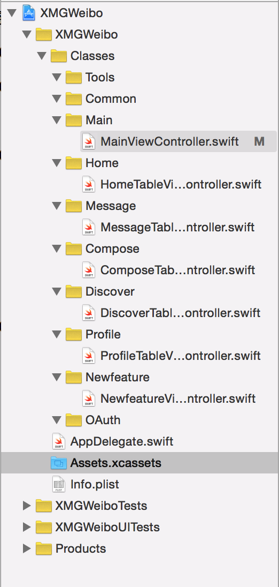

# 创建文件

## 准备工作

### 删除模板文件

* ViewController.swift
* Main.storyboard
* LaunchScreen.xib

### 创建项目结构

#### 主目录 `Classes`

#### 二级目录

| 目录名 | 说明 |
| -- | -- |
| Main | 主要 |
| Home | 首页 |
| Message | 消息 |
| Discover | 发现 |
| Profile | 我 |
| Tools | 工具类 |

## 创建项目文件

### Main

| 目录 | Controller |
| -- | -- |
| Main | MainViewController.swift(`:UITabBarController`) |

### 功能模块

| 目录 | Controller |
| -- | -- |
| Home | HomeTableViewController.swift |
| Message | MessageTableViewController.swift |
| Discover | DiscoverTableViewController.swift |
| Profile | ProfileTableViewController.swift |

#### 细节

* 每个 ViewController 继承自 `UITableViewController`
* 搭建完成的文件结构图如下：



* 修改 `AppDelegate` 中的 `didFinishLaunchingWithOptions` 函数，设置启动控制器

```swift
window?.rootViewController = MainViewController()
```
