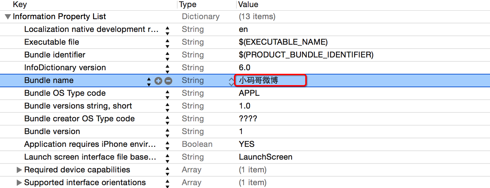
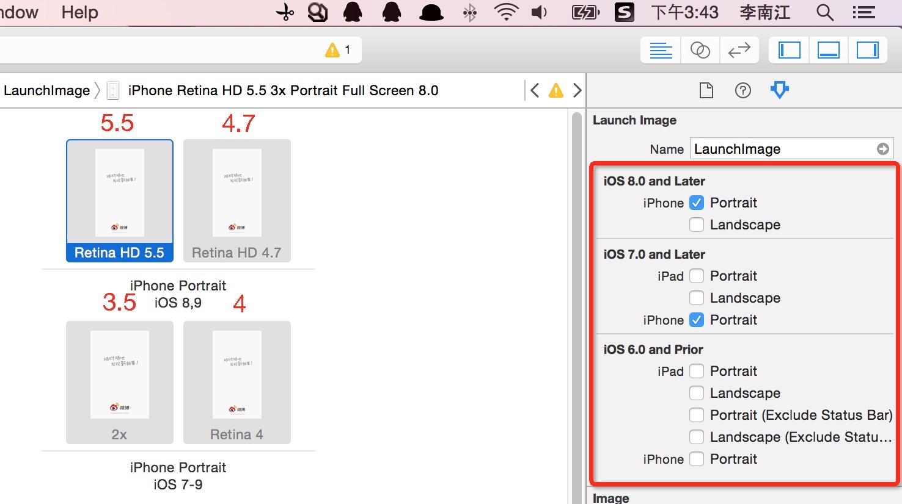

# 图标素材 & App 名称

## 图标素材

### 设置图标选项

* 如下图所示，删除 `Launch Screen File` & `Main.storyboard`，并且设置`启动图片`和`应用方向`

> 提示：iPhone 项目一般不需要支持横屏，游戏除外


## 通过代码创建根控制器

* 在 `AppDelegate` 的 `didFinishLaunchingWithOptions` 函数中添加以下代码：

```swift
window = UIWindow(frame: UIScreen.mainScreen().bounds)
window?.backgroundColor = UIColor.whiteColor()
window?.rootViewController = ViewController()

window?.makeKeyAndVisible()
```
---
### 添加图标


---
## App 名称



* 提示
    * 此处修改的内容是 `Info.plist` 中 `CFBundleName` 对应的内容
    * 注意不要超过6个中文，否则会影响用户体验

---
### 添加启动图片



* 提示
    * 关于启动图片的设置，需要注意上课的操作细节
    * 关于各个设备的实际屏幕尺寸，注意一下不同类型的启动图片即可
