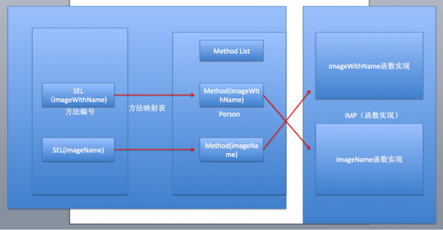

# Runtime简介和作用

 
---
```objc
Update更新：2016年5月20日 By {MISSAJJ琴瑟静听}
```
### 一、runtime简介
*	RunTime简称运行时。OC就是`运行时机制`，也就是在运行时候的一些机制，其中最主要的是消息机制。
*	对于C语言，`函数的调用在编译的时候会决定调用哪个函数`。
*	对于OC的函数，属于`动态调用过程`，在编译的时候并不能决定真正调用哪个函数，只有在真正运行的时候才会根据函数的名称找到对应的函数来调用。
*	事实证明：
	*	在编译阶段，OC可以`调用任何函数`，即使这个函数并未实现，只要声明过就不会报错。
	*	在编译阶段，C语言调用`未实现的函数`就会报错。

### 二、runtime作用

####1.发送消息
*	方法调用的本质，就是让对象发送消息。
*	objc_msgSend,只有对象才能发送消息，因此以objc开头.
*	使用`消息机制`前提，必须导入#import <objc/message.h>
*	消息机制简单使用

```objc
 	// 创建person对象
    Person *p = [[Person alloc] init];
    
    // 调用对象方法
    [p eat];
    
    // 本质：让对象发送消息
    objc_msgSend(p, @selector(eat));

    // 调用类方法的方式：两种
    // 第一种通过类名调用
    [Person eat];
    // 第二种通过类对象调用
    [[Person class] eat];
    
    // 用类名调用类方法，底层会自动把类名转换成类对象调用
    // 本质：让类对象发送消息
    objc_msgSend([Person class], @selector(eat));

```
* 消息机制原理:对象根据方法编号SEL去映射表查找对应的方法实现
	
    
 

####2.交换方法
*	开发使用场景:系统自带的方法功能不够，给系统自带的方法扩展一些功能，并且保持原有的功能。
*	方式一:继承系统的类，重写方法.
*	方式二:使用runtime,交换方法.


```objc
@implementation ViewController


- (void)viewDidLoad {
    [super viewDidLoad];
    // Do any additional setup after loading the view, typically from a nib.
    // 需求：给imageNamed方法提供功能，每次加载图片就判断下图片是否加载成功。
    // 步骤一：先搞个分类，定义一个能加载图片并且能打印的方法+ (instancetype)imageWithName:(NSString *)name;
    // 步骤二：交换imageNamed和imageWithName的实现，就能调用imageWithName，间接调用imageWithName的实现。
    UIImage *image = [UIImage imageNamed:@"123"];
    
}

@end


@implementation UIImage (Image)
// 加载分类到内存的时候调用
+ (void)load
{
    // 交换方法
    
    // 获取imageWithName方法地址
    Method imageWithName = class_getClassMethod(self, @selector(imageWithName:));
    
    // 获取imageWithName方法地址
    Method imageName = class_getClassMethod(self, @selector(imageNamed:));

    // 交换方法地址，相当于交换实现方式
    method_exchangeImplementations(imageWithName, imageName);
    
    
}

// 不能在分类中重写系统方法imageNamed，因为会把系统的功能给覆盖掉，而且分类中不能调用super.

// 既能加载图片又能打印
+ (instancetype)imageWithName:(NSString *)name
{
   
    // 这里调用imageWithName，相当于调用imageName
    UIImage *image = [self imageWithName:name];
    
    if (image == nil) {
        NSLog(@"加载空的图片");
    }
    
    return image;
}


@end
```

* 交换原理：
	* 交换之前：
	

  * 交换之后：

    


 
####3.动态添加方法
* 开发使用场景：如果一个类方法非常多，加载类到内存的时候也比较耗费资源，需要给每个方法生成映射表，可以使用动态给某个类，添加方法解决。
* 经典面试题：有没有使用performSelector，其实主要想问你有没有动态添加过方法。
* 简单使用

```objc
@implementation ViewController

- (void)viewDidLoad {
    [super viewDidLoad];
    // Do any additional setup after loading the view, typically from a nib.
    
    Person *p = [[Person alloc] init];
    
    // 默认person，没有实现eat方法，可以通过performSelector调用，但是会报错。
    // 动态添加方法就不会报错
    [p performSelector:@selector(eat)];
    
}


@end


@implementation Person
// void(*)()
// 默认方法都有两个隐式参数，
void eat(id self,SEL sel)
{
    NSLog(@"%@ %@",self,NSStringFromSelector(sel));
}

// 当一个对象调用未实现的方法，会调用这个方法处理,并且会把对应的方法列表传过来.
// 刚好可以用来判断，未实现的方法是不是我们想要动态添加的方法
+ (BOOL)resolveInstanceMethod:(SEL)sel
{
    
    if (sel == @selector(eat)) {
        // 动态添加eat方法
        
        // 第一个参数：给哪个类添加方法
        // 第二个参数：添加方法的方法编号
        // 第三个参数：添加方法的函数实现（函数地址）
        // 第四个参数：函数的类型，(返回值+参数类型) v:void @:对象->self :表示SEL->_cmd
        class_addMethod(self, @selector(eat), eat, "v@:");
        
    }
    
    return [super resolveInstanceMethod:sel];
}
@end

```


####4.给分类添加属性
* 原理：给一个类声明属性，其实本质就是给这个类添加关联，并不是直接把这个值的内存空间添加到类存空间。

```objc

@implementation ViewController

- (void)viewDidLoad {
    [super viewDidLoad];
    // Do any additional setup after loading the view, typically from a nib.
    
    // 给系统NSObject类动态添加属性name
    
    NSObject *objc = [[NSObject alloc] init];
    objc.name = @"小码哥";
    NSLog(@"%@",objc.name);
    
}


@end


// 定义关联的key
static const char *key = "name";

@implementation NSObject (Property)

- (NSString *)name
{
    // 根据关联的key，获取关联的值。
    return objc_getAssociatedObject(self, key);
}

- (void)setName:(NSString *)name
{
    // 第一个参数：给哪个对象添加关联
    // 第二个参数：关联的key，通过这个key获取
    // 第三个参数：关联的value
    // 第四个参数:关联的策略
    objc_setAssociatedObject(self, key, name, OBJC_ASSOCIATION_RETAIN_NONATOMIC);
}

@end


```


####5.字典转模型
* 设计模型：字典转模型的第一步
	* 模型属性，通常需要跟字典中的key一一对应
	* 问题：一个一个的生成模型属性，很慢？
	* 需求：能不能自动根据一个字典，生成对应的属性。
	* 解决：提供一个分类，专门根据字典生成对应的属性字符串。
	
```objc
	@implementation NSObject (Log)


// 自动打印属性字符串
+ (void)resolveDict:(NSDictionary *)dict{

    // 拼接属性字符串代码
    NSMutableString *strM = [NSMutableString string];
    
    // 1.遍历字典，把字典中的所有key取出来，生成对应的属性代码
    [dict enumerateKeysAndObjectsUsingBlock:^(id  _Nonnull key, id  _Nonnull obj, BOOL * _Nonnull stop) {
        
        // 类型经常变，抽出来
         NSString *type;
        
        if ([obj isKindOfClass:NSClassFromString(@"__NSCFString")]) {
            type = @"NSString";
        }else if ([obj isKindOfClass:NSClassFromString(@"__NSCFArray")]){
            type = @"NSArray";
        }else if ([obj isKindOfClass:NSClassFromString(@"__NSCFNumber")]){
            type = @"int";
        }else if ([obj isKindOfClass:NSClassFromString(@"__NSCFDictionary")]){
            type = @"NSDictionary";
        }

        
        // 属性字符串
        NSString *str;
        if ([type containsString:@"NS"]) {
            str = [NSString stringWithFormat:@"@property (nonatomic, strong) %@ *%@;",type,key];
        }else{
            str = [NSString stringWithFormat:@"@property (nonatomic, assign) %@ %@;",type,key];
        }
        
        // 每生成属性字符串，就自动换行。
        [strM appendFormat:@"\n%@\n",str];
        
    }];
    
    // 把拼接好的字符串打印出来，就好了。
    NSLog(@"%@",strM);
    
}


@end

```

* 字典转模型的方式一：KVC

```objc
@implementation Status


+ (instancetype)statusWithDict:(NSDictionary *)dict
{
    Status *status = [[self alloc] init];
    
    [status setValuesForKeysWithDictionary:dict];
    
    return status;
    
}

@end

```


*	KVC字典转模型弊端：必须保证，模型中的属性和字典中的key一一对应。
	*	如果不一致，就会调用`[<Status 0x7fa74b545d60> setValue:forUndefinedKey:]`
报`key`找不到的错。	
	*  分析:模型中的属性和字典的key不一一对应，系统就会调用`setValue:forUndefinedKey:`报错。
	*  解决:重写对象的`setValue:forUndefinedKey:`,把系统的方法覆盖，
就能继续使用KVC，字典转模型了。

```objc
- (void)setValue:(id)value forUndefinedKey:(NSString *)key
{
    
}

```

* 字典转模型的方式二：Runtime
	* 思路：利用运行时，遍历模型中所有属性，根据模型的属性名，去字典中查找key，取出对应的值，给模型的属性赋值。
	* 步骤：提供一个NSObject分类，专门字典转模型，以后所有模型都可以通过这个分类转。 

```objc

@implementation ViewController

- (void)viewDidLoad {
    [super viewDidLoad];
    // Do any additional setup after loading the view, typically from a nib.
    
    // 解析Plist文件
    NSString *filePath = [[NSBundle mainBundle] pathForResource:@"status.plist" ofType:nil];

    NSDictionary *statusDict = [NSDictionary dictionaryWithContentsOfFile:filePath];
    
    // 获取字典数组
    NSArray *dictArr = statusDict[@"statuses"];
    
    // 自动生成模型的属性字符串
//    [NSObject resolveDict:dictArr[0][@"user"]];
    
    
    _statuses = [NSMutableArray array];
    
    // 遍历字典数组
    for (NSDictionary *dict in dictArr) {
        
        Status *status = [Status modelWithDict:dict];
        
        [_statuses addObject:status];
        
    }
    
    // 测试数据
    NSLog(@"%@ %@",_statuses,[_statuses[0] user]);
    
    
}

@end

@implementation NSObject (Model)

+ (instancetype)modelWithDict:(NSDictionary *)dict
{
    // 思路：遍历模型中所有属性-》使用运行时
    
    // 0.创建对应的对象
    id objc = [[self alloc] init];
    
    // 1.利用runtime给对象中的成员属性赋值
    
    // class_copyIvarList:获取类中的所有成员属性
    // Ivar：成员属性的意思
    // 第一个参数：表示获取哪个类中的成员属性
    // 第二个参数：表示这个类有多少成员属性，传入一个Int变量地址，会自动给这个变量赋值
    // 返回值Ivar *：指的是一个ivar数组，会把所有成员属性放在一个数组中，通过返回的数组就能全部获取到。
    /* 类似下面这种写法
     
     Ivar ivar;
     Ivar ivar1;
     Ivar ivar2;
     // 定义一个ivar的数组a
     Ivar a[] = {ivar,ivar1,ivar2};
     
     // 用一个Ivar *指针指向数组第一个元素
     Ivar *ivarList = a;
     
     // 根据指针访问数组第一个元素
     ivarList[0];
     
     */
    unsigned int count;
    
    // 获取类中的所有成员属性
    Ivar *ivarList = class_copyIvarList(self, &count);
    
    for (int i = 0; i < count; i++) {
        // 根据角标，从数组取出对应的成员属性
        Ivar ivar = ivarList[i];
        
        // 获取成员属性名
        NSString *name = [NSString stringWithUTF8String:ivar_getName(ivar)];
        
        // 处理成员属性名->字典中的key
        // 从第一个角标开始截取
        NSString *key = [name substringFromIndex:1];

        // 根据成员属性名去字典中查找对应的value
        id value = dict[key];
        
        // 二级转换:如果字典中还有字典，也需要把对应的字典转换成模型
        // 判断下value是否是字典
        if ([value isKindOfClass:[NSDictionary class]]) {
            // 字典转模型
            // 获取模型的类对象，调用modelWithDict
            // 模型的类名已知，就是成员属性的类型
            
            // 获取成员属性类型
           NSString *type = [NSString stringWithUTF8String:ivar_getTypeEncoding(ivar)];
          // 生成的是这种@"@\"User\"" 类型 -》 @"User"  在OC字符串中 \" -> "，\是转义的意思，不占用字符
            // 裁剪类型字符串
            NSRange range = [type rangeOfString:@"\""];

           type = [type substringFromIndex:range.location + range.length];
            
            range = [type rangeOfString:@"\""];
            
            // 裁剪到哪个角标，不包括当前角标
          type = [type substringToIndex:range.location];

            
            // 根据字符串类名生成类对象
            Class modelClass = NSClassFromString(type);
            

            if (modelClass) { // 有对应的模型才需要转
                
                // 把字典转模型
                value  =  [modelClass modelWithDict:value];
            }
            
            
        }
        
        // 三级转换：NSArray中也是字典，把数组中的字典转换成模型.
        // 判断值是否是数组
        if ([value isKindOfClass:[NSArray class]]) {
            // 判断对应类有没有实现字典数组转模型数组的协议
            if ([self respondsToSelector:@selector(arrayContainModelClass)]) {
                
                // 转换成id类型，就能调用任何对象的方法
                id idSelf = self;
                
                // 获取数组中字典对应的模型
                NSString *type =  [idSelf arrayContainModelClass][key];
                
                // 生成模型
               Class classModel = NSClassFromString(type);
                NSMutableArray *arrM = [NSMutableArray array];
                // 遍历字典数组，生成模型数组
                for (NSDictionary *dict in value) {
                    // 字典转模型
                  id model =  [classModel modelWithDict:dict];
                    [arrM addObject:model];
                }
                
                // 把模型数组赋值给value
                value = arrM;
                
            }
        }
        
        
        if (value) { // 有值，才需要给模型的属性赋值
            // 利用KVC给模型中的属性赋值
            [objc setValue:value forKey:key];
        }
        
    }
    
    return objc;
}

@end


```


