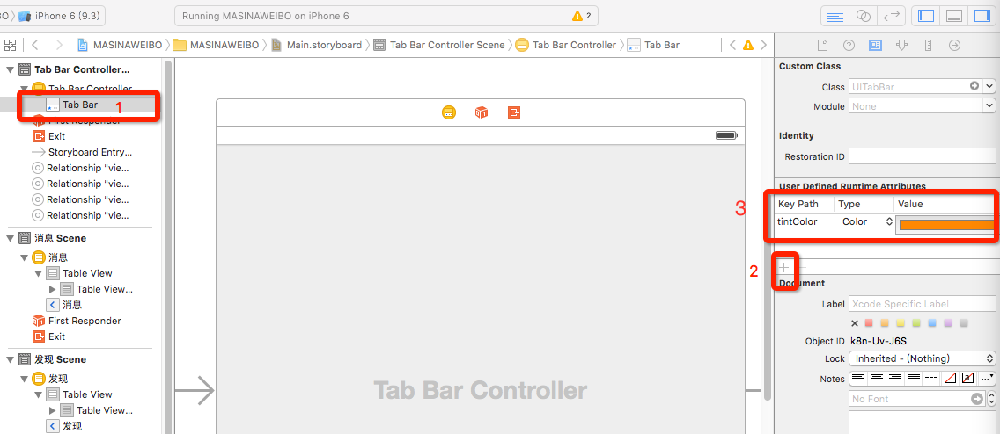
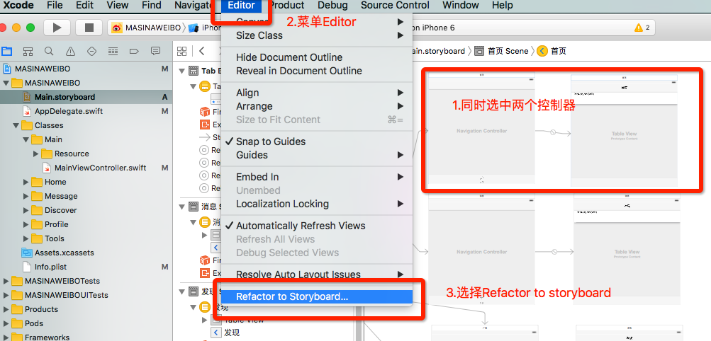
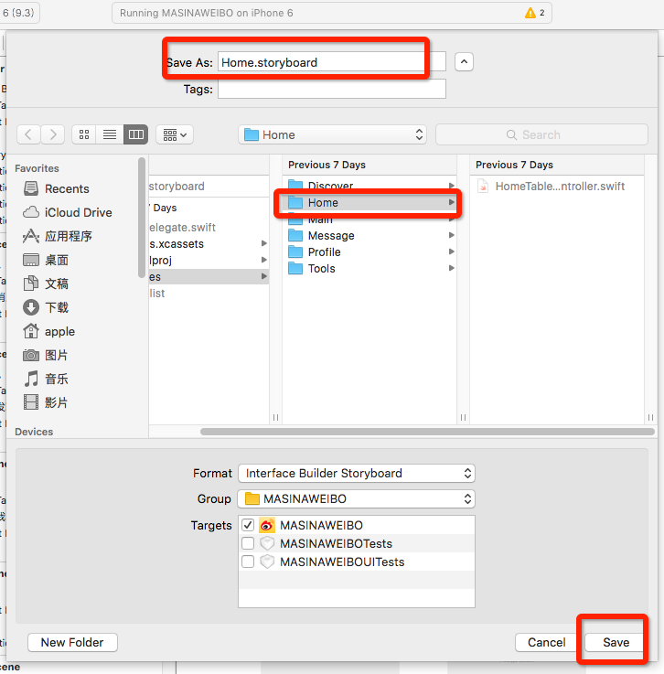
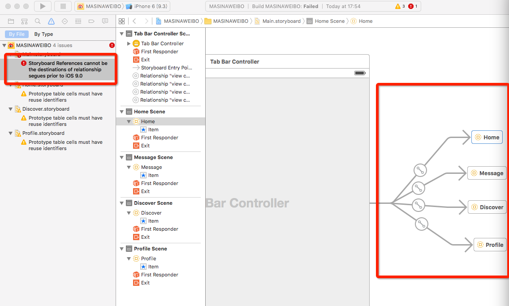
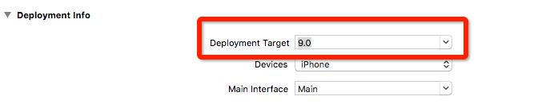

# storyboard快速创建项目框架
---
```objc
Update更新：2016年5月30日 By {MISSAJJ琴瑟静听} 
```

如何用 storyboard创建项目是基本功,所以太初级的内容不多写了, 在此写几个有用的功能

###如何通过storyboard添加tintColor
```
1.设置 Tabbar 的 tintColor, 要点击 tabbar再设置
2.keyPath 为 tintColor,type 选择 Color, 然后选择颜色即可
```
 
 
 ###Refactor to Storyboard 仅支持 IOS9.0
 
早期 storyboard 对于团队开发很不友好,所以一般很少用 storyboard, 在 IOS9.0 之后有了Refactor to Storyboard 功能, 可以将不同的界面独立分开给团队人员,下面简单讲一下如何设置Refactor to Storyboard 

-  创建Refactor to Storyboard



-  保存故事版文件





- Refactor to Storyboard 仅支持 IOS9.0



- 修改支持 IOS9.0


