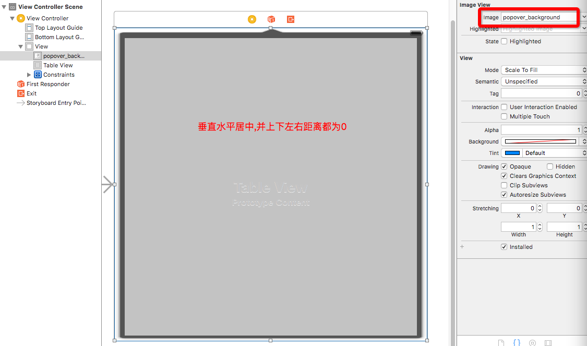

# 通过Storyboard布局下拉菜单

---
```objc
Update更新：2016年6月2日 By {MISSAJJ琴瑟静听} 
```


##继续布局菜单


- 布局动画演示


- 创建Popover.storyboard

  - 布局Popover向上箭头背景视图
  

  - 布局Popover中Tableview控件
 


- 添加点击下拉菜单后的菜单栏
 


```Swift
 @objc private func titleBtnClick(btn: TitleButton)
    {
        // 1.修改按钮的状态
        btn.selected = !btn.selected
        
        // 2.显示菜单
        // 2.1创建菜单
        let sb = UIStoryboard(name: "Popover", bundle: nil)
        guard let menuView = sb.instantiateInitialViewController() else
        {
            return
        }
        // 自定义专场动画
        // 设置转场代理
        menuView.transitioningDelegate = self
        // 设置转场动画样式为 自定义Custom
        menuView.modalPresentationStyle = UIModalPresentationStyle.Custom
        
        // 2.2弹出菜单
        presentViewController(menuView, animated: true, completion: nil)
    }

//转场动画代理
extension HomeTableViewController: UIViewControllerTransitioningDelegate
{
    // 该方法用于返回一个负责转场动画的对象
    func presentationControllerForPresentedViewController(presented: UIViewController, presentingViewController presenting: UIViewController, sourceViewController source: UIViewController) -> UIPresentationController?
    {
        //新建继承与UIPresentationController的MAPresentationController类来重写转场方法
        return MAPresentationController(presentedViewController: presented, presentingViewController: presenting)
    }
}
```

- 添加点击下拉菜单后的菜单栏

```Swift

//  MAPresentationController.swift
//  XMGWB
//
//  Created by MISSAJJ on 16/6/2.
//  Copyright © 2016年 MISSAJJ. All rights reserved.
//

import UIKit

class MAPresentationController: UIPresentationController {

    /*
    1.如果不自定义转场modal出来的控制器会移除原有的控制器
    2.如果自定义转场modal出来的控制器不会移除原有的控制器
    3.如果不自定义转场modal出来的控制器的尺寸和屏幕一样
    4.如果自定义转场modal出来的控制器的尺寸我们可以自己在containerViewWillLayoutSubviews方法中控制
    5.containerView 非常重要, 容器视图, 所有modal出来的视图都是添加到containerView上的
    6.presentedView() 非常重要, 通过该方法能够拿到弹出的视图
    */
    
    //override重写init方法
    override init(presentedViewController: UIViewController, presentingViewController: UIViewController) {
        super.init(presentedViewController: presentedViewController, presentingViewController: presentingViewController)
    }
    
    // 用于布局转场动画弹出的控件
    override func containerViewWillLayoutSubviews()
    {
        // 设置弹出视图的尺寸
        presentedView()?.frame = CGRect(x: 100, y: 45, width: 200, height: 200)
    }
}

```

