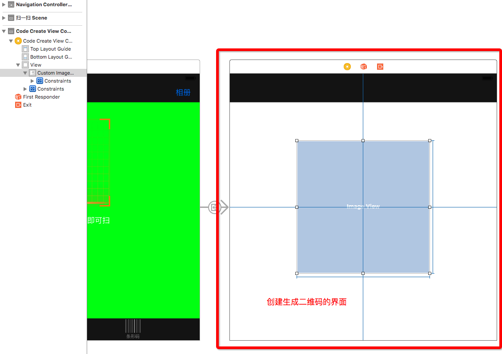

#  生成二维码图片

---
```objc
Update更新：2016年6月3日 By {MISSAJJ琴瑟静听} 
```
##创建界面




##创建生成二维码类,设置滤镜
- QRCodeCreateViewController.swift

```swift
// 二维码容器
    @IBOutlet weak var customImageVivew: UIImageView!
    
    override func viewDidLoad() {
        super.viewDidLoad()
        // 1.创建滤镜
        let filter = CIFilter(name: "CIQRCodeGenerator")
        // 2.还原滤镜默认属性
        filter?.setDefaults()
        // 3.设置需要生成二维码的数据到滤镜中
        // OC中要求设置的是一个二进制数据
        filter?.setValue("极客江南".dataUsingEncoding(NSUTF8StringEncoding), forKeyPath: "InputMessage")
        // 4.从滤镜从取出生成好的二维码图片
        guard let ciImage = filter?.outputImage else
        {
            return
        }
    
     //生成二维码(比较模糊)
     //customImageVivew.image = UIImage(CIImage: ciImage)
 
     //生成高清二维码
     customImageVivew.image = createNonInterpolatedUIImageFormCIImage(ciImage, size: 500) 
    }
    

```


##生成高清二维码
- 默认生成的二维码图片会比较模糊
- 生成高清二维码,请替换以下方法

```swift

/**
     生成高清二维码
     
     - parameter image: 需要生成原始图片
     - parameter size:  生成的二维码的宽高
     */
    private func createNonInterpolatedUIImageFormCIImage(image: CIImage, size: CGFloat) -> UIImage {
        
        let extent: CGRect = CGRectIntegral(image.extent)
        let scale: CGFloat = min(size/CGRectGetWidth(extent), size/CGRectGetHeight(extent))
        
        // 1.创建bitmap;
        let width = CGRectGetWidth(extent) * scale
        let height = CGRectGetHeight(extent) * scale
        let cs: CGColorSpaceRef = CGColorSpaceCreateDeviceGray()!
        let bitmapRef = CGBitmapContextCreate(nil, Int(width), Int(height), 8, 0, cs, 0)!
        
        let context = CIContext(options: nil)
        let bitmapImage: CGImageRef = context.createCGImage(image, fromRect: extent)
        
        CGContextSetInterpolationQuality(bitmapRef,  CGInterpolationQuality.None)
        CGContextScaleCTM(bitmapRef, scale, scale);
        CGContextDrawImage(bitmapRef, extent, bitmapImage);
        
        // 2.保存bitmap到图片
        let scaledImage: CGImageRef = CGBitmapContextCreateImage(bitmapRef)!
        
        return UIImage(CGImage: scaledImage)
    }

```