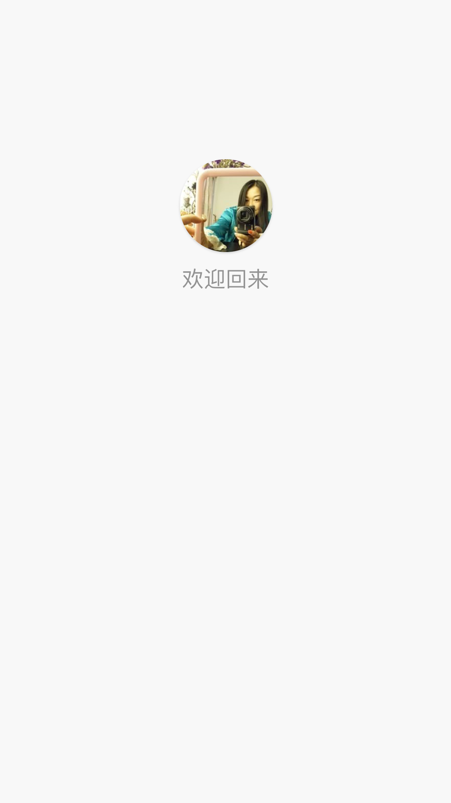
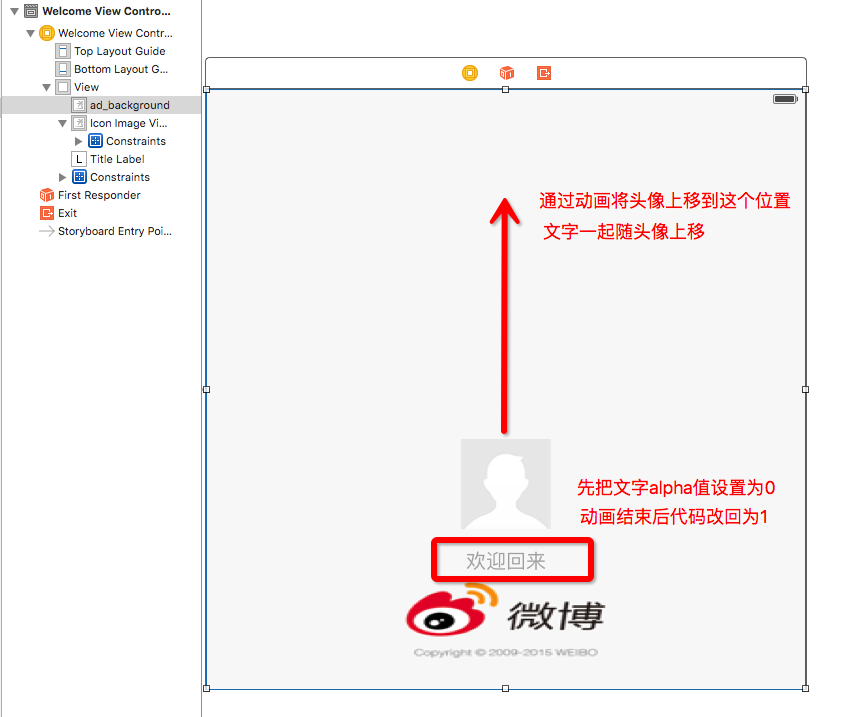

# 新浪微博动画欢迎界面

新浪微博在登陆后打开APP会出现一个欢迎界面,此界面会有一个将用户头像从下至上移动的动画, 动画结束后出现"欢迎回来"文字,这个界面很简单但是却对用户很友好.


###欢迎界面演示




###搭建欢迎界面

- Welcome.storyboard




###欢迎界面实现代码

- WelcomeViewController.swift 


```swift 
//  WelcomeViewController.swift 

import UIKit
import SDWebImage

class WelcomeViewController: UIViewController {
    /// 头像底部约束
    @IBOutlet weak var iconBottomCons: NSLayoutConstraint!
    /// 标题
    @IBOutlet weak var titleLabel: UILabel!
    /// 头像容器
    @IBOutlet weak var iconImageView: UIImageView!
    
    override func viewDidLoad() {
        super.viewDidLoad()

        // 1.设置头像圆角
        iconImageView.layer.cornerRadius = 45
//        iconImageView.layer.masksToBounds = true
        iconImageView.clipsToBounds = true
        
        assert(UserAccount.loadUserAccount() != nil, "必须授权之后才能显示欢迎界面")
        // 2.设置头像
        guard let url = NSURL(string: UserAccount.loadUserAccount()!.avatar_large!) else
        {
            return
        }
        iconImageView.sd_setImageWithURL(url)
    }
    
    override func viewDidAppear(animated: Bool) {
        super.viewDidAppear(animated)
        
        // 1.让头像执行动画
        //调整头像底部约束
        //暂定屏幕高 减去 头像底部至屏幕底部的约束高= 就是头像移动到的位置高
        iconBottomCons.constant = (UIScreen.mainScreen().bounds.height - iconBottomCons.constant)
        
        UIView.animateWithDuration(2.0, animations: { () -> Void in
            //这一句很重要哦~
            self.view.layoutIfNeeded()
            }) { (_) -> Void in
                
                UIView.animateWithDuration(2.0, animations: { () -> Void in
                
                   //显现"欢迎回来"文字
                    self.titleLabel.alpha = 1.0
                    }, completion: { (_) -> Void in
                        
                })
        }
    }
}
```