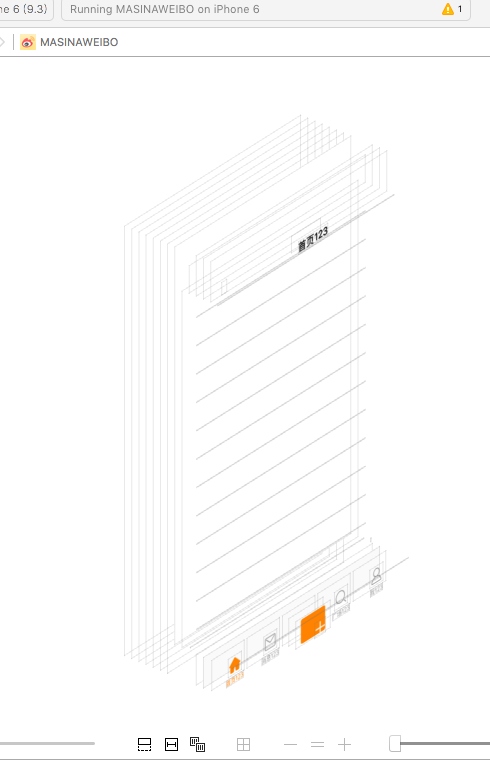

# 自定义 TabBar:添加加号按钮
---
```objc
Update更新：2016年5月30日 By {MISSAJJ琴瑟静听} 
```
## 功能需求

* 在 4 个控制器切换按钮中间增加一个撰写按钮
* 点击撰写按钮能够弹出对话框撰写微博

### 需求分析

* 添加占位控制器
* 计算控制器按钮位置，在中间添加一个 `撰写` 按钮

### 添加占位控制器

```swift
    /**
    添加所有子控制
    */
    private func addChildViewControllers()
    {
        addChildViewController(HomeTableViewController(), title: "首页", imageName: "tabbar_home")
        addChildViewController(MessageTableViewController(), title: "消息", imageName: "tabbar_message_center")
        
        // 添加一个占位的控制器
        addChildViewController("NullViewController", title: "", imageName: "")
        
        addChildViewController(DiscoverTableViewController(), title: "发现", imageName: "tabbar_discover")
        addChildViewController(ProfileTableViewController(), title: "我", imageName: "tabbar_profile")
    }
```


###json 同步添加占位控制器NullViewController
MainVCSettings.json
```
 [
  {
  "vcName": "HomeTableViewController",
  "title": "首页",
  "imageName": "tabbar_home"
  },
  {
  "vcName": "MessageTableViewController",
  "title": "消息",
  "imageName": "tabbar_message_center"
  }, 
  {
  "vcName": "NullViewController",
  "title": "",
  "imageName": ""
  }, 
  {
  "vcName": "DiscoverTableViewController",
  "title": "广场",
  "imageName": "tabbar_discover"
  },
  {
  "vcName": "ProfileTableViewController",
  "title": "我",
  "imageName": "tabbar_profile"
  }
  ]

```
### 撰写按钮懒加载

```swift
/// 撰写按钮
    lazy private var composeButton:UIButton = {
        // 1.创建按钮
        let button = UIButton()
        // 2.设置图片
        button.setImage(UIImage(named: "tabbar_compose_icon_add"), forState: UIControlState.Normal)
        button.setImage(UIImage(named: "tabbar_compose_icon_add_highlighted"), forState: UIControlState.Highlighted)
        // 3.设置背景图片
        button.setBackgroundImage(UIImage(named: "tabbar_compose_button"), forState: UIControlState.Normal)
        button.setBackgroundImage(UIImage(named: "tabbar_compose_button_highlighted"), forState: UIControlState.Highlighted)
        // 5.添加到tabBar上
        // Swift中能不写self就不写self, 在闭包中必须写self
        self.tabBar.addSubview(button)
        // 6.返回按钮
        return button
    }()
```

* 先测试代码的可行性，再来细化 UI
* 懒加载的代码是一个闭包，因此在代码内部需要使用 `self.`

### 调整界面布局
* 在 `MainViewController` 中添加以下代码，并且增加断点

```swift
override func viewDidLoad() {
    super.viewDidLoad()

    addChildViewControllers()

    // The tab bar view associated with this controller. (read-only)
    print(tabBar)
    print(tabBar.items)
}

override func viewWillAppear(animated: Bool) {
    super.viewWillAppear(animated)

    print(__FUNCTION__)
    print(tabBar.items)
}
```

* 运行测试，通过调用堆栈观察可以发现

* viewDidLoad 方法调用是实例化控制器方法触发的


* 此时只是创建子控制器，而由于界面还没有显示，按照 iOS 开发的延迟创建原则，tabBar 中的 items 还没有被创建

* viewWillAppear 方法是由 `makeKeyAndVisible` 方法触发的


* 此时需要开始准备将控制器的子视图添加到界面上，因此 tabBar 中的 items 已经被创建

* 因此可以考虑在 viewWillAppear 方法中 计算加号按钮位置


###在viewWillAppear中添加按钮和调整位置
```Swift
 override func viewWillAppear(animated: Bool) {
        super.viewWillAppear(animated)
        
        // 添加中间按钮
        tabBar.addSubview(composeBtn)
        // 保存按钮尺寸
        let rect = composeBtn.frame
        // 计算宽度
        let width = tabBar.bounds.width / CGFloat(childViewControllers.count)
        // 设置按钮的位置
        composeBtn.frame = CGRect(x: 2 * width, y: 0, width: width, height: rect.height)
        // 设置按钮frame和偏移位 (通过偏移位是另一种思路, 但是如果美工做的图片大小比例不是屏幕1/5宽就会导致产生位置误差,建议还是用上边的2.创建按钮frame)
        //composeButton.frame = CGRectOffset(rect, 2 * width, 0)
    }

```
 

### 撰写按钮点击处理
- 无返回值的点击处理
```swift
    lazy private var composeButton:UIButton = {
       
        ....省略 
        button.addTarget(self, action: "composetBtnClick", forControlEvents: UIControlEvents.TouchUpInside) 
        return button
    }()

    //  运行循环监听到事件后，向 VC 发送消息，动态执行 方法，因此不能设置为 private
    func composetBtnClick()
    {
        print(__FUNCTION__)
    }
```
- 有返回值的点击处理

```Swift
  selector写成:action: Selector("compseBtnClick:")
  
  func composeBtnClick(btn : UIButton) { 
        MALog(btn)
    }
```
> 注意：`composetBtnClick` 函数不能使用 `private` 修饰，因为当系统监听到按钮点击事件时，会给控制器发送 `composetBtnClick` 消息，如果设置成私有函数


###权限public,internal,private

```
    public : 最大权限, 可以在当前framework和其他framework中访问
    internal : 默认的权限, 可以在当前framework中随意访问
    private : 私有权限, 只能在当前文件中访问
    以上权限可以修饰属性/方法/类
    
    注意: 在企业开发中建议严格的控制权限, 不想让别人访问的东西一定要private

 ```    
 -  [会报错] private func 告诉系统需要动态派发 
 
```Swift   
    //注意: 给按钮的监听方法加上private会导致报错,
    //报错原因是因为监听事件是由运行循环触发的, 
    //而如果该方法是私有的只能在当前类中访问
     private func compseBtnClick(btn: UIButton)  
     {
          NJLog(btn)
     }
```    
      
- 告诉系统需要动态派发@objc private func 
```     
    而相同的情况在OC中是没有问题, 因为OC是动态派发的
    而Swift不一样, Swift中所有的东西都在是编译时确定的
    如果想让Swift中的方法也支持动态派发, 可以在方法前面加上 @objc
    加上 @objc就代表告诉系统需要动态派发 
``` 
```Swift    
     @objc private func compseBtnClick(btn: UIButton)
     {
          NJLog(btn)
     }
```
### Swift懒加载UIButton的标准写法

- 标准写法

```Swift 
    // MARK: - 懒加载
    private lazy var composeButton: UIButton = {
        () -> UIButton   
        in              //以上两行可以省略
         
        ....设置按钮属性
        return btn
    }()

```
- 懒加载示例

```Swift
    
    //监听按钮
    func composeBtnClick(btn : UIButton) {
        
        MALog(btn)
    }
    
    // MARK: - 懒加载
    private lazy var composeButton: UIButton = {
        () -> UIButton   
        in              //以上两行可以省略
        
        // 1.创建按钮
        let btn = UIButton()
        // 2.设置前景图片
        btn.setImage(UIImage(named: "tabbar_compose_icon_add"), forState: UIControlState.Normal)
        btn.setImage(UIImage(named: "tabbar_compose_icon_add_highlighted"), forState: UIControlState.Highlighted)
        // 3.设置背景图片
        btn.setBackgroundImage(UIImage(named: "tabbar_compose_button"), forState: UIControlState.Normal)
        btn.setBackgroundImage(UIImage(named: "tabbar_compose_button_highlighted"), forState: UIControlState.Highlighted)
        // 4.监听按钮点击
        btn.addTarget(self, action: Selector("compseBtnClick:"), forControlEvents: UIControlEvents.TouchUpInside)
        // 4.调整按钮尺寸
        btn.sizeToFit()
        
        return btn
    }()

```


###完整演示代码

```Swift

//
//  MainViewController.swift
//  MASINAWEIBO
//
//  Created by MISSAJJ on 16/5/26.
//  Copyright © 2016年 MISSAJJ. All rights reserved.
//

import UIKit

class MainViewController: UITabBarController {
    
    override func viewDidLoad() {
        super.viewDidLoad()
        
        // iOS7以后只需要设置tintColor, 那么图片和文字都会按照tintColor渲染
        tabBar.tintColor = UIColor.orangeColor()
        tabBar.backgroundImage = UIImage.init(named: "tabbar_background")
        
        //添加所有子控制器
        addChildViewControllers()
        
    }
    
    override func viewWillAppear(animated: Bool) {
        super.viewWillAppear(animated)
        
        //添加中间按钮
        tabBar.addSubview(composeBtn)
        // 保存按钮尺寸
        let rect = composeBtn.frame
        // 计算宽度
        let width = tabBar.bounds.width / CGFloat(childViewControllers.count)
        // 设置按钮的位置
        composeBtn.frame = CGRect(x: 2 * width, y: 0, width: width, height: rect.height)
        //        composeButton.frame = CGRectOffset(rect, 2 * width, 0)
    }
    //MARK: - 添加所有子控制器
    func addChildViewControllers()
    {
        
        // 1.根据JSON文件创建控制器
        // 1.1读取JSON数据
        guard let filePath =  NSBundle.mainBundle().pathForResource("MainVCSettings.json", ofType: nil) else
        {
            MALog("JSON文件不存在")
            return
        }
        
        guard let data = NSData(contentsOfFile: filePath) else
        {
            MALog("加载二进制数据失败")
            return
        }
        
        // 1.2将JSON数据转换为对象(数组字典)
        do
        {
            /*
             Swift和OC不太一样, OC中一般情况如果发生错误会给传入的指针赋值, 而在Swift中使用的是异常处理机制
             1.以后但凡看大 throws的方法, 那么就必须进行 try处理, 而只要看到try, 就需要写上do catch
             2.do{}catch{}, 只有do中的代码发生了错误, 才会执行catch{}中的代码
             3. try  正常处理异常, 也就是通过do catch来处理
             try! 告诉系统一定不会有异常, 也就是说可以不通过 do catch来处理
             但是需要注意, 开发中不推荐这样写, 一旦发生异常程序就会崩溃
             如果没有异常那么会返回一个确定的值给我们
             
             try? 告诉系统可能有错也可能没错, 如果没有系统会自动将结果包装成一个可选类型给我们, 如果有错系统会返回nil, 如果使用try? 那么可以不通过do catch来处理
             */
            
            let objct = try NSJSONSerialization.JSONObjectWithData(data, options: NSJSONReadingOptions.MutableContainers) as! [[String: AnyObject]]
            
            
            for dict in objct  {
                
                // 1.4根据遍历到的字典创建控制器
                let title = dict["title"] as? String
                let vcName = dict["vcName"] as? String
                let imageName = dict["imageName"] as? String
                addChildViewController(vcName, title: title, imageName: imageName)
            }
            
        }catch
        {
            
            //默认的菜单
            // 只要try对应的方法发生了异常, 就会执行catch{}中的代码
            addChildViewController("HomeTableViewController", title: "首页", imageName: "tabbar_home")
            addChildViewController("MessageTableViewController", title: "消息", imageName: "tabbar_message_center")
            addChildViewController("NullViewController", title: "", imageName: "")
            addChildViewController("DiscoverTableViewController", title: "发现", imageName: "tabbar_discover")
            addChildViewController("ProfileTableViewController", title: "我", imageName: "tabbar_profile")
            
        }
        
        
        
    }
    
    //MARK: - 添加一个子控制器
    func addChildViewController(childControllerName: String?, title: String?, imageName: String?) {
        
        /*
         guard 条件表达式 else {
         //            需要执行的语句
         //            只有条件为假才会执行{}中的内容
         return
         }
         guard可以有效的解决可选绑定容易形成{}嵌套问题
         */
        
        // 1.动态获取命名空间
        // 由于字典/数组中只能存储对象, 所以通过一个key从字典中获取值取出来是一个AnyObject类型, 并且如果key写错或者没有对应的值, 那么就取不到值, 所以返回值可能有值也可能没值, 所以最终的类型是AnyObject?
        guard let name =  NSBundle.mainBundle().infoDictionary!["CFBundleExecutable"] as? String else
        {
            MALog("获取命名空间失败")
            return
        }
        
        /*
         Swift中新增了一个叫做命名空间的概念
         作用: 避免重复
         不用项目中的命名空间是不一样的, 默认情况下命名空间的名称就是当前项目的名称
         正是因为Swift可以通过命名空间来解决重名的问题, 所以在做Swift开发时尽量使用cocoapods来集成三方框架, 这样可以有效的避免类名重复
         正是因为Swift中有命名空间, 所以通过一个字符串来创建一个类和OC中也不太一样了, OC中可以直接通过类名创建一个类, 而Swift中如果想通过类名来创建一个类必须加上命名空间
         */
        
        var cls: AnyClass? = nil
        
        if let  vcName = childControllerName
        {
            cls = NSClassFromString(name + "." + vcName)
            
        }
        
        // Swift中如果想通过一个Class来创建一个对象, 必须告诉系统这个Class的确切类型
        guard let typeCls = cls as? UITableViewController.Type else
        {
            MALog("cls不能当做UITableViewController")
            return
        }
        
        // 通过Class创建对象
        let childController = typeCls.init()
        MALog(childController)
        
        
        
        //添加子控制器
        
        //取消图片被系统自动渲染,设置原始状态代码UIImage.init(named: imageName)?.imageWithRenderingMode(.AlwaysOriginal)
        if let ivName = imageName
        {
            //childController.tabBarItem.image = UIImage.init(named: imageName)
            childController.tabBarItem.image = UIImage.init(named: ivName)?.imageWithRenderingMode(.AlwaysOriginal)
            childController.tabBarItem.selectedImage = UIImage.init(named: ivName + "_highlighted")?.imageWithRenderingMode(.AlwaysOriginal)
            
        }
        
        
        
        //设置自控制器的导航栏标题
        childController.title = title
        
        //包装导航控制器
        let nav = UINavigationController.init(rootViewController: childController)
        
        //将子控制器添加到UITabBarController中
        addChildViewController(nav)
        
        
        
    }
    
    /*
     public : 最大权限, 可以在当前framework和其他framework中访问
     internal : 默认的权限, 可以在当前framework中随意访问
     private : 私有权限, 只能在当前文件中访问
     以上权限可以修饰属性/方法/类
     
     在企业开发中建议严格的控制权限, 不想让别人访问的东西一定要private
     */
    // 如果给按钮的监听方法加上private就会报错, 报错原因是因为监听事件是由运行循环触发的, 而如果该方法是私有的只能在当前类中访问
    // 而相同的情况在OC中是没有问题, 因为OC是动态派发的
    // 而Swift不一样, Swift中所有的东西都在是编译时确定的
    // 如果想让Swift中的方法也支持动态派发, 可以在方法前面加上 @objc
    // 加上 @objc就代表告诉系统需要动态派发
    func composeBtnClick(btn : UIButton) {
        
        MALog(btn)
    }
    //MARK : - 懒加载
    private  lazy var composeBtn: UIButton = {
        () -> UIButton
        in
        
        // 1.创建按钮
        let btn = UIButton()
        // 2.设置前景图片
        btn.setImage(UIImage(named: "tabbar_compose_icon_add"), forState: UIControlState.Normal)
        btn.setImage(UIImage(named: "tabbar_compose_icon_add_highlighted"), forState: UIControlState.Highlighted)
        // 3.设置背景图片
        btn.setBackgroundImage(UIImage(named: "tabbar_compose_button"), forState: UIControlState.Normal)
        btn.setBackgroundImage(UIImage(named: "tabbar_compose_button_highlighted"), forState: UIControlState.Highlighted)
        
        // 4.监听按钮点击
        btn.addTarget(self, action: Selector("compseBtnClick:"), forControlEvents: UIControlEvents.TouchUpInside)
        // 4.调整按钮尺寸
        btn.sizeToFit()
        return btn
        
    }()
}

```

###添加中间按钮层级图

