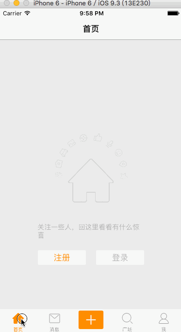

# 首页动画
---
```objc
Update更新：2016年5月30日 By {MISSAJJ琴瑟静听} 
```
* 添加动画代码

```swift
/// 开始动画
func startAnimation() {
    let anim = CABasicAnimation(keyPath: "transform.rotation")
    anim.toValue = 2 * M_PI
    anim.repeatCount = MAXFLOAT
    anim.duration = 20.0

    iconView.layer.addAnimation(anim, forKey: nil)
}

```

* 在 `HomeTableViewController` 中增加如下代码，开始和停止动画

```swift
func setupVisitorInfo(isHome: Bool, imageName: String, message: String){
        iconView.hidden = !isHome
        messageLabel.text = message
        homeIconView.image = UIImage(named: imageName)

        if isHome{
            startAnimation()
        }
    }

```
###模拟器动画演示图




