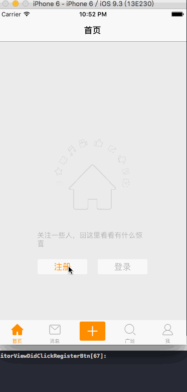

# 登录&注册代理回调

---
```objc
Update更新：2016年5月30日 By {MISSAJJ琴瑟静听} 
```

###模拟器演示




###定义协议

```swift
/// 访客视图协议
protocol VisitorViewDelegate: NSObjectProtocol
{
    // 默认情况下协议中的方法都是必须实现的
    func visitorViewDidClickLoginBtn(visitor: VisitorView)
    func visitorViewDidClickRegisterBtn(visitor: VisitorView)
}

```

> 定义协议时，需要继承自 `NSObjectProtocol`，否则无法设置代理的类型

###定义代理

```swift
// 定义代理:和OC一样代理属性必须使用weak修饰
    weak var delegate: VisitorViewDelegate?
```

* 按钮回调

```swift
    // 点击注册按钮
    @IBAction func registerBtnClick(sender: AnyObject) {
        // 和OC不一样, Swift中如果简单的调用代理方法, 不用判断代理能否响应
        delegate?.visitorViewDidClickRegisterBtn(self)
    }
    //点击登录按钮
    @IBAction func loginBtnClick(sender: AnyObject) {
        delegate?.visitorViewDidClickLoginBtn(self)
    }
```

###遵守协议

```swift
class BaseTableViewController: UITableViewController, VisitorViewDelegate
```
###设置代理

```swift
// 设置代理
visitorLoginView?.delegate = self
```

###实现方法

```swift
// MARK: - 访客视图协议方法
  // 用户注册
    func visitorViewDidClickLoginBtn(visitor: VisitorView)
    {
        MALog("")
    }
    // 用户登录
    func visitorViewDidClickRegisterBtn(visitor: VisitorView)
    {
        MALog("")
    }
```

###如果没有在头部遵守协议

```swift
//如果头部没有写上VisitorViewDelegate这个代理协议 
import UIKit  
class BaseTableViewController: UITableViewController

那么需要在项目单独写代理延展代码

extension BaseTableViewController: VisitorViewDelegate
{
    // 用户注册
    func visitorViewDidClickLoginBtn(visitor: VisitorView)
    {
        MALog("")
    }
    // 用户登录
    func visitorViewDidClickRegisterBtn(visitor: VisitorView)
    {
        MALog("")
    }
}
```


###修改导航条按钮监听方法

```swift
navigationItem.leftBarButtonItem = UIBarButtonItem(title: "注册", style: UIBarButtonItemStyle.Plain, target: self, action: "visitorViewRegister")
navigationItem.rightBarButtonItem = UIBarButtonItem(title: "登录", style: UIBarButtonItemStyle.Plain, target: self, action: "visitorViewLogin")
```

###完整代码示例

```Swift
//
//  VisitorView.swift
//  MASINAWEIBO
//
//  Created by MISSAJJ on 16/5/30.
//  Copyright © 2016年 MISSAJJ. All rights reserved.
//

import UIKit


protocol VisitorViewDelegate: NSObjectProtocol
{
    // 默认情况下协议中的方法都是必须实现的
    func visitorViewDidClickLoginBtn(visitor: VisitorView)
    func visitorViewDidClickRegisterBtn(visitor: VisitorView)
} 

class VisitorView: UIView {
     
    
    // 注册按钮
    @IBOutlet weak var registerButton: UIButton!
    // 登录按钮
    @IBOutlet weak var loginButton: UIButton!
    // 动画转盘
    @IBOutlet weak var rotationImageView: UIImageView!
    // 图标
    @IBOutlet weak var iconImageView: UIImageView!
    // 文本标签
    @IBOutlet weak var titleLabel: UILabel!
    
    
    
    /// 代理
    // 和OC一样代理属性必须使用weak修饰
        weak var delegate: VisitorViewDelegate?
    
    
    
    //设置访客视图上的数据imageName需要显示的图标 , title需要显示的标题
    //home的imageName 是 xib 里设置的不需要另外设置,所以设置 nil 就可以了,所以是 string? 可选状态
    func setupVisitorInfo(imageName: String? , title: String)
    {
        // 1.设置标题
        titleLabel.text = title
        
        // 2.判断是否是首页 (String?为可选,所以要通过 guard 判定)
        guard let name = imageName else
        {
            // 没有设置图标为->首页
            // 执行转盘动画
            startAnimation()
            
            return
        }
        
        // 3.设置其他数据
        // 不是首页
        rotationImageView.hidden = true
        
        iconImageView.image = UIImage(named: name)
        
    }
     
    private func startAnimation()
    {
        
        // 1.创建旋转动画transform.rotation
        let anim =  CABasicAnimation(keyPath: "transform.rotation")
        
        // 2.设置动画属性
        anim.toValue = 2 * M_PI
        anim.duration = 5.0
        anim.repeatCount = MAXFLOAT
        
        // 注意: 默认情况下只要视图消失, 系统就会自动移除动画
        // 只要设置removedOnCompletion为false, 系统就不会移除动画
        anim.removedOnCompletion = false
        
        // 3.将动画添加到图层上
        rotationImageView.layer.addAnimation(anim, forKey: nil) 
    }
     
    //    func 相当于 OC 中 -号开头的方法
    //    class func  相当于 OC 中 +号开头的方法
    
    //快速创建 xib
    class func visitorView() -> VisitorView {
        
        return NSBundle.mainBundle().loadNibNamed("VisitorView", owner: nil, options: nil).last as! VisitorView
        
    }
     
    // 点击注册按钮
    @IBAction func registerBtnClick(sender: AnyObject) {
        // 和OC不一样, Swift中如果简单的调用代理方法, 不用判断代理能否响应
        delegate?.visitorViewDidClickRegisterBtn(self)
    }
    //点击登录按钮
    @IBAction func loginBtnClick(sender: AnyObject) {
        delegate?.visitorViewDidClickLoginBtn(self)
    }
}

```

```Swift
//
//  BaseTableViewController.swift
//  MASINAWEIBO
//
//  Created by MISSAJJ on 16/5/30.
//  Copyright © 2016年 MISSAJJ. All rights reserved.
//

import UIKit

/*
 通知 : 层级结构较深
 代理 : 父子 , 方法较多时候使用
 block: 父子, 方法较少时使用(一般情况一个方法)
 */
class BaseTableViewController: UITableViewController/*,VisitorViewDelegate */{
    
    // 定义标记记录用户登录状态
    var  isLogin  = false
    // 访客视图
    var visitorView: VisitorView?
    
    override func loadView() {
        
        // 判断用户是否登录, 如果没有登录就显示访客界面, 如果已经登录就显示tableview
        
        isLogin ? super.loadView() : setupVisitorView()
        
    }
    
    // MARK: - 内部控制方法
    private func setupVisitorView()
    {
        //设置访客视图:很重要,否则视图的数据将显示不出来
        visitorView = VisitorView.visitorView()
        view = visitorView
        
        
         // 2.设置代理
        visitorView?.delegate = self
        
    }
    
    
//    // 用户注册
//    func visitorViewDidClickLoginBtn(visitor: VisitorView)
//    {
//        MALog("")
//    }
//    // 用户登录
//    func visitorViewDidClickRegisterBtn(visitor: VisitorView)
//    {
//        MALog("")
//    }
}

//如果没有在顶部定义代理协议,就在这里单独写代理方法
extension BaseTableViewController: VisitorViewDelegate
{
    // 用户注册
    func visitorViewDidClickLoginBtn(visitor: VisitorView)
    {
        MALog("")
    }
    // 用户登录
    func visitorViewDidClickRegisterBtn(visitor: VisitorView)
    {
        MALog("")
    }
}
```