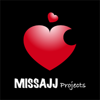

###MISSAJJ琴瑟静听（ Swift 和 Objective-C ）iOS 开发项目电子书
---

####★近期正在研究新浪微博的Swift项目,会陆续更新笔记哦,欢迎关注更新★
```objc
Update 更新：2016年6月2日 By {MISSAJJ琴瑟静听} 

友情提示：
“高效工具资源及分享”里的免费 MAC 软件下载地址随时会失效，
 下载到就是赚到！你懂的！^_^
```



```objc
 {  心乎爱矣, 
    遐不谓矣,
    中心藏之, 
    何日忘之.  }
           
           MISSAJJ琴瑟静听 
 ```
#### Why 为什么要写电子书? 
 

```objc
一直想为自己写一本书，
传记，散文，诗集，小说，
可最终决定执笔而写的，
却是这本关于 iOS 开发的电子书^_^

这本书整合学习过的 iOS 开发教程笔记，
融入所接触的 iOS 项目中的点滴体会，
亦抒发和宣泄自己对于 iOS 开发的喜爱。

希望能帮助一些学习开发的 "新手攻城狮" 温故而知新，
也是一本用心良苦想送给儿子 Winnie 的 iOS 启蒙书……
```  

###Say Something - 碎碎念
```objc 
请别叫我大神，三人行必有我师，谢谢！^_^
请别问我是真男还是假女，我已是个10岁孩子的妈咪，谢谢！^_^ 

“你写书就是为了能找好工作？”
请别问这样的弱智问题，如果写书就能找到好工作，
那么大家都别做工程师，别写代码了，谢谢！^_^

// MARK：重申 
1，写书是为了更好的坚持学习。
    坚持归纳总结，
    坚持细化学习过程，
    坚持温故而知新。
  
2，可以帮助学 iOS 开发的童鞋们少走点弯路。
    做一件公益的事情，
    Why not？
   
3，一本DIY的书，一份有意义的文化遗产。
    送给长大后也想做工程师的儿子,
    Winnie，妈咪爱你！

          2016年5月26日 By {MISSAJJ琴瑟静听} 

```
###Chapters 目录章节
---

```
注意: 如果是通过电脑在 GitBook 官方网站在线阅读,
点以下章节目录链接无效,请点网站右边【READ】按钮阅读,
手机端和 Github 阅读可以点以下目录章节链接跳转在线阅读。
```

* [Introduction 前言介绍](README.md)

* [★【Chapter-01  MISSAJJ高效工具资源分享】](MISSAJJ琴瑟静听高效工具资源及分享/README.md)
   * [Mac 高效工具资源及分享](MISSAJJ琴瑟静听高效工具资源及分享/gao_xiao_gong_ju_zi_yuan_ji_fen_xiang.md)   (更新)
   * [Xcode开发必备-优秀插件分享](MISSAJJ琴瑟静听高效工具资源及分享/xcodekai_fa_bi_5907-_you_xiu_cha_jian_fen_xiang.md)   (更新)
   * [Github-iOS 优秀代码集萃 和 面试题集锦](MISSAJJ琴瑟静听高效工具资源及分享/github-ios_you_xiu_dai_ma_ji_cui_he_mian_shi_ti_ji.md)   (更新)
   * [Mac系统常用快捷键以及技巧大全](MISSAJJ琴瑟静听高效工具资源及分享/macxi_tong_chang_yong_kuai_jie_jian_yi_ji_ji_qiao_.md)   (更新)
   * [Markdown 语法整理](MISSAJJ琴瑟静听高效工具资源及分享/markdownyu_fa_zheng_li.md)
   * [CocoaPods 的使用](MISSAJJ琴瑟静听高效工具资源及分享/cocoapodsde_shi_yong.md)
   * [项目管理 Git 常用命令](MISSAJJ琴瑟静听高效工具资源及分享/xiangmu_guan_li_git_chang_yong_ming_ling.md)
 

* [★【Chapter-02  MISSAJJ琴瑟静听 iOS 项目开发 OC 语言课程笔记】](MISSAJJ琴瑟静听IOS项目开发OC语言课程笔记/README.md)
   * [iOS 项目开发综合笔记](MISSAJJ琴瑟静听IOS项目开发OC语言课程笔记/iosxiang_mu_kai_fa_zong_he_bi_ji.md)
   * [PCH 文件的设置创建](MISSAJJ琴瑟静听IOS项目开发OC语言课程笔记/pchwen_jian_de_she_zhi_chuang_jian.md)
   * [const，static，extern简介、作用和使用](MISSAJJ琴瑟静听IOS项目开发OC语言课程笔记/conststaticexternjian_jie_3001_zuo_yong_he_shi_yon.md)
   * [在 Xib 中设置 UIScrollView](MISSAJJ琴瑟静听IOS项目开发OC语言课程笔记/zaixib_zhong_she_zhi_uiscrollview.md)
   * [使用 Xib 引入模型的自定义控件案例](MISSAJJ琴瑟静听IOS项目开发OC语言课程笔记/shi_yong_xib_yin_ru_mo_xing_de_zi_ding_yi_kong_jia.md)
   * [assign 和 weak 的区别](MISSAJJ琴瑟静听IOS项目开发OC语言课程笔记/assignhe_weak_de_qu_bie.md)
   * [判断 NSString 字符串或 NSArray 数组是否为空](MISSAJJ琴瑟静听IOS项目开发OC语言课程笔记/panduan_nsstring_zi_fu_chuan_huo_nsarray_shu_zu_sh.md)
   * [颜色相关知识和宏代码](MISSAJJ琴瑟静听IOS项目开发OC语言课程笔记/yan_se_xiang_guan_zhi_shi_he_hong_dai_ma.md)
   * [渐变动画 UIViewAnimation 的几种方法：位移，缩放，透明](MISSAJJ琴瑟静听IOS项目开发OC语言课程笔记/jian_bian_dong_hua_uiviewanimation_de_ji_zhong_fan.md)
   * [NSDate NSCalendar 时间日期换算](MISSAJJ琴瑟静听IOS项目开发OC语言课程笔记/nsdate_nscalendarshi_jian_ri_qi_huan_suan.md)
   * [UIAlertController 的使用](MISSAJJ琴瑟静听IOS项目开发OC语言课程笔记/uialertcontrollerde_shi_yong.md)
   * [计算行页数 文本宽度 文件及文件夹大小](MISSAJJ琴瑟静听IOS项目开发OC语言课程笔记/ji_suan_xing_ye_shu_wen_ben_kuan_du_wen_jian_ji_we.md)
   * [相机相簿存图 UIImagePicker SDK](MISSAJJ琴瑟静听IOS项目开发OC语言课程笔记/xiang_jixiang_bu_cun_tu_uiimagepicker_sdk.md)
   * [消息推送通知](MISSAJJ琴瑟静听IOS项目开发OC语言课程笔记/xiao_xi_tui_song_tong_zhi.md)
   * [Runtime 简介和作用](MISSAJJ琴瑟静听IOS项目开发OC语言课程笔记/runtimejian_jie_he_zuo_yong.md)


* [★【Chapter-03  UIKit 框架下的各类控件和知识点】](UIKit框架下的各类控件和知识点/README.md)
   * [所有控件的父类:UIView](UIKit框架下的各类控件和知识点/suo_you_kong_jian_de_fu_7c7b3a_uiview.md)
   * [Frame 和 Bounds 及尺寸位置](UIKit框架下的各类控件和知识点/framehe_bounds_ji_chi_cun_wei_zhi.md)
   * [UITextField UILabel 图文混排](UIKit框架下的各类控件和知识点/uitextfield_uilabel_tu_wen_hun_pai.md)
   * [UILabel 控件-文本](UIKit框架下的各类控件和知识点/uilabelkong_4ef6-_wen_ben.md)


* [★【Chapter-04 地图定位 CoreLocation 框架】](地图定位CoreLocation框架/README.md)
   * [（I）不同 iOSi系统地图定位的注意点](地图定位CoreLocation框架/iff09_bu_tong_ios_xi_tong_di_tu_ding_wei_de_zhu_yi.md)
   * [（II）地图定位 CoreLocation 框架](地图定位CoreLocation框架/iiff09ditu_ding_wei_corelocation_kuang_jia.md)
   * [（III）MISSAJJ整理的 MALocationTool 定位工具类](地图定位CoreLocation框架/iiimissajjzheng_li_de_malocationtool_ding_wei_gong.md)


* [★【Chapter-05 蓝牙交互 CoreBlueTooth】](蓝牙交互CoreBlueTooth/README.md)
   * [（I）蓝牙交互 CoreBlueTooth](蓝牙交互CoreBlueTooth/iff09_lan_ya_jiaohu_corebluetooth.md)
   * [（II）蓝牙交互 GameKit](蓝牙交互CoreBlueTooth/iiff09_lan_ya_jiao_hu_gamekit.md)
   * [（III）蓝牙交互 Mutipeer Connectivity](蓝牙交互CoreBlueTooth/iiiff09_lan_ya_jiaohu_mutipeer_connectivity.md)


* [★【Chapter-06 ReactiveCocoa (RAC) 编程思想和 MVVM 架构进阶】](ReactiveCocoa（RAC）编程思想和MVVM架构进阶/README.md)
   * [(I)  ReactiveCocoa（RAC）编程思想和 MVVM 架构进阶](ReactiveCocoa（RAC）编程思想和MVVM架构进阶/i_reactivecocoa_racff09_bian_cheng_si_xiang_he_mvv.md)
   * [(II)  ReactiveCocoa（RAC）编程思想和 MVVM 架构进阶](ReactiveCocoa（RAC）编程思想和MVVM架构进阶/ii_reactivecocoa_racff09_bian_cheng_si_xiang_he_mv.md)
   * [(III)  ReactiveCocoa（RAC）编程思想和 MVVM 架构进阶](ReactiveCocoa（RAC）编程思想和MVVM架构进阶/iii_reactivecocoa_racff09_bian_cheng_si_xiang_he_m.md)
   * [(IV)  ReactiveCocoa（RAC）编程思想和 MVVM 架构进阶](ReactiveCocoa（RAC）编程思想和MVVM架构进阶/iv_reactivecocoa_racff09_bian_cheng_si_xiang_he_mv.md)
   * [(V) ReactiveCocoa（RAC）编程思想和 MVVM 架构进阶](ReactiveCocoa（RAC）编程思想和MVVM架构进阶/v_reactivecocoaracff09_bian_cheng_si_xiang_he_mvvm.md)


* [★【Chapter-07 MISSAJJ琴瑟静听 Swift 基础语言课程笔记】](MISSAJJ琴瑟静听Swift基础语言课程笔记/SUMMARY.md) (更新)
   * [Swift-入门介绍](MISSAJJ琴瑟静听Swift基础语言课程笔记/README.md)
   * [Swift-数据类型](MISSAJJ琴瑟静听Swift基础语言课程笔记/12.Swift-数据类型.md)
   * [Swift-常量&变量](MISSAJJ琴瑟静听Swift基础语言课程笔记/01.Swift-常量&变量.md)
   * [Swift-逻辑分支](MISSAJJ琴瑟静听Swift基础语言课程笔记/02.Swift-逻辑分支.md)
   * [Swift-循环](MISSAJJ琴瑟静听Swift基础语言课程笔记/03.Swift-循环.md)
   * [Swift-字符串](MISSAJJ琴瑟静听Swift基础语言课程笔记/04.Swift-字符串.md)
   * [Swift-数组](MISSAJJ琴瑟静听Swift基础语言课程笔记/05.Swift-数组.md)
   * [Swift-字典](MISSAJJ琴瑟静听Swift基础语言课程笔记/06.Swift-字典.md)
   * [Swift-元祖](MISSAJJ琴瑟静听Swift基础语言课程笔记/13.Swift-元祖.md)
   * [Swift-可选类型](MISSAJJ琴瑟静听Swift基础语言课程笔记/14.Swift-可选类型.md)
   * [Swift-函数](MISSAJJ琴瑟静听Swift基础语言课程笔记/07.Swift-函数.md)
   * [Swift-类的定义](MISSAJJ琴瑟静听Swift基础语言课程笔记/15.Swift-类的定义.md)
   * [Swift-类的构造函数](MISSAJJ琴瑟静听Swift基础语言课程笔记/16.Swift-类的构造函数.md)
   * [Swift-闭包](MISSAJJ琴瑟静听Swift基础语言课程笔记/08.Swift-闭包.md)
   * [Swift-懒加载](MISSAJJ琴瑟静听Swift基础语言课程笔记/09.Swift-懒加载.md)
   * [Swift-getter & setter](MISSAJJ琴瑟静听Swift基础语言课程笔记/10.Swift-getter&setter.md)
   * [Swift-ATS应用传输安全](MISSAJJ琴瑟静听Swift基础语言课程笔记/11.Swift-ATS应用传输安全.md)


* [★【Chapter-08 MISSAJJ琴瑟静听新浪微博Swift项目课程笔记】](MISSAJJ琴瑟静听新浪微博Swift项目课程笔记/README.md)   (更新)
   * [0.1. 项目Git部署（使用OSChina开源中国)](MISSAJJ琴瑟静听新浪微博Swift项目课程笔记/oschina.md) 
   * [0.2. 图片素材](MISSAJJ琴瑟静听新浪微博Swift项目课程笔记/imagesassets.md) 
       * [0.2.1. 图标素材 & App 名称](MISSAJJ琴瑟静听新浪微博Swift项目课程笔记/imagesassets-01-icon_default.md) 
   * [0.3. 项目搭建](MISSAJJ琴瑟静听新浪微博Swift项目课程笔记/createproject.md)   
       * [0.3.1. 创建文件](MISSAJJ琴瑟静听新浪微博Swift项目课程笔记/createproject-01-createfiles.md)  
           * [0.3.1.1 创建自定义Log](MISSAJJ琴瑟静听新浪微博Swift项目课程笔记/0311_chuang_jian_zi_ding_yi_log.md)  
       * [0.3.2. 添加子控制器](MISSAJJ琴瑟静听新浪微博Swift项目课程笔记/createproject-02-addchildcontrollers.md)  
           * [0.3.2.0.Name Space 命名空间](MISSAJJ琴瑟静听新浪微博Swift项目课程笔记/0320name_space_ming_ming_kong_jian.md)  
           * [0.3.2.1. throw catch](MISSAJJ琴瑟静听新浪微博Swift项目课程笔记/throw_catch.md)  
           * [0.3.2.2. 变量类型推导](MISSAJJ琴瑟静听新浪微博Swift项目课程笔记/variablestype.md) 
       * [0.3.3. 添加加号按钮](MISSAJJ琴瑟静听新浪微博Swift项目课程笔记/createproject-03-costommaintabbar.md)  
       * [0.3.4. 阶段性小结](MISSAJJ琴瑟静听新浪微博Swift项目课程笔记/createproject-04-summary.md)   
       * [0.3.5.storyboard快速创建项目框架](MISSAJJ琴瑟静听新浪微博Swift项目课程笔记/035storyboardkuai_su_chuang_jian_xiang_mu_kuang_ji.md)  
   * [0.4. 未登录页面处理](MISSAJJ琴瑟静听新浪微博Swift项目课程笔记/visitor.md)  
       * [0.4.1. 表格视图控制器基类](MISSAJJ琴瑟静听新浪微博Swift项目课程笔记/visitor-01-basetableviewcontroller.md)  
       * [0.4.2. 用户登录视图](MISSAJJ琴瑟静听新浪微博Swift项目课程笔记/visitor-02-userloginview.md)  
       * [0.4.3. 设置未登录信息](MISSAJJ琴瑟静听新浪微博Swift项目课程笔记/visitor-03-loginlogic.md) 
       * [0.4.4. 首页动画](MISSAJJ琴瑟静听新浪微博Swift项目课程笔记/visitor-04-homeanimation.md)  
       * [0.4.5. 登录&注册代理回调](MISSAJJ琴瑟静听新浪微博Swift项目课程笔记/visitor-05-logindelegate.md)  
       * [0.4.6. 设置全局外观](MISSAJJ琴瑟静听新浪微博Swift项目课程笔记/visitor-06-setupappearance.md)  
       * [0.4.7. 阶段性小结](MISSAJJ琴瑟静听新浪微博Swift项目课程笔记/visitor-07-summary.md)  
   * [0.5. 代码评审(Code Review)](MISSAJJ琴瑟静听新浪微博Swift项目课程笔记/code_review.md) 
   * [0.6.主界面导航栏按钮和下拉菜单](MISSAJJ琴瑟静听新浪微博Swift项目课程笔记/06dao_hang_tiao_biao_ti_cai_dan_an_niu.md)   (更新)
       * [0.6.1.导航栏左右按钮](MISSAJJ琴瑟静听新浪微博Swift项目课程笔记/061dao_hang_lan_zuo_you_an_niu.md)   (更新)
       * [0.6.2.导航栏下拉菜单](MISSAJJ琴瑟静听新浪微博Swift项目课程笔记/062dao_hang_lan_xia_la_cai_dan.md)   (更新)
           * [0.6.2.1.通过Storyboard布局下拉菜单](MISSAJJ琴瑟静听新浪微博Swift项目课程笔记/0621tong_guo_storyboard_bu_ju_xia_la_cai_dan.md)   (更新)
           * [0.6.2.2.完善下拉菜单转场效果](MISSAJJ琴瑟静听新浪微博Swift项目课程笔记/0622wan_shan_xia_la_cai_dan_zhuan_chang_xiao_guo.md)   (更新)
           * [0.6.2.3.封装优化下拉菜单的转场效果](MISSAJJ琴瑟静听新浪微博Swift项目课程笔记/0623feng_zhuang_you_hua_xia_la_cai_dan_de_zhuan_ch.md)   (更新)
 

```
本书更多章节会在 GitBook 和 Github 同步更新，敬请关注收藏^_^
```
####Download 下载地址
 
* [GitBook 在线阅读地址](https://missajj.gitbooks.io/missajj_iosdevelopment_gitbook/content/)
* [GitHub 同步阅读地址](https://github.com/MISSAJJ/MISSAJJ_IOS_DEVELOPMENT_BOOK)
* [PDF 版本电子书下载](https://www.gitbook.com/download/pdf/book/missajj/missajj_iosdevelopment_gitbook)
* [ePub 版本电子书下载](https://www.gitbook.com/download/epub/book/missajj/missajj_iosdevelopment_gitbook)
* [Mobi 版本电子书下载](https://www.gitbook.com/download/mobi/book/missajj/missajj_iosdevelopment_gitbook)

---


####Contact 联系方式
 
-  MISSAJJ网站 : http://www.MISSAJJ.com 

```objc
  - 此域名解析在海外服务器近4年,如今满怀爱国之心想回归祖国
  - 但是天朝个人网站的 ICP 备案好麻烦哦~
  - 网站名不能是英文名? 不能是博客? 若是博客还需要待预审?...
  - 反复被拒绝了4次以上了, 竟然比 Appstore 审核 APP 还要麻烦!!!
  - 索性暂时关闭,大大滴写上"网站正在等待中国工信部ICP备案中"
  - ICP 审核人员:你们慢慢~慢慢 and 慢慢~慢慢~审核吧,姐姐我不伺候了!
```  
  
- Blog : http://cz.jiboit.com 
  - （临时的MISSAJJ网站地址，感谢技柏科技免费提供国内空间）
- Github  : https://github.com/MISSAJJ
- GitBook : https://www.gitbook.com/@missajj

```objc 
本人目前正在尝试将过去的项目陆续编译成 Swift 语言，
同时也会陆续整理相关 Swift 语言开发的课程笔记, 
希望能有更多的狮子一起共勉探讨学习，愉快奔跑！ 
联系方式: QQ 996174446 ［验证：iOS 攻城狮］
``` 
####Thanks 特别感谢 
  
```objc
感谢 Jobs 的激励，感谢 Limon 和 邦Ben 的建议,
感谢传智、小码哥、MJ 等各种视频课程及资料的启发，
感谢美国同事 Matt 、美国朋友 Joseph 和 Danny 分享的资源，
感谢越南同事 Brian (极客)对我所提出的各种SB问题的解答和帮助,
感谢亲爱哒读者们给我点的 Stars, 感谢大家的关注,支持,建议和吐槽。
```
####Reading 阅读说明  

```objc
此书使用 MarkDown 标记语言，
用 GitBook 编写，不定期更新。

手机阅读建议点以下 GitBook 在线阅读地址浏览
查看此书章节目录，请点顶部最左边的菜单按钮
直接阅读此书，请点底部 > 箭头按钮开始阅读
```
 * [GitBook在线阅读地址](https://missajj.gitbooks.io/missajj_iosdevelopment_gitbook/content/)

