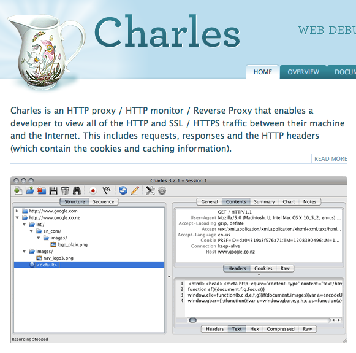

#Share Resources 高效工具资源及分享
```
Update更新：2016年5月13日 By {MISSAJJ琴瑟静听}
```
MISSAJJ分享给大家一些用下来觉得非常得心应手的工具，帮助大家一起提高开发效率及提升技术能力，欢迎大家联系分享资源。

##项目的图片资源
- 可以利用一个Mac软件解压 
 - https://github.com/devcxm/iOS-Images-Extractor

##生成PNG图标的工具
- 可以根据需求对应@2X，@3X的尺寸生成对应的图标，平时用这个比较多，快速高效。
- 感谢美国同事Matt分享给我这个工具
   - http://iconion.com 


##将MAC应用免费进行到底！

- 首先申明：本人绝对尊重原版！！！
- 喜欢这个网站里的一句话 “我们不Hack软件，我们是只是优秀软件的搬运工” ^_^
- 我平日所用的很多MAC软件，如设计Adobe系列和Sketch，抓包Charles，思维Xmind等软件……都是在这个网站里下载的,全部免费哦！
- 感谢这个网站为我们省了几千美金了！

  - 爱情守望者网站 : http://www.waitsun.com/

##Github-iOS代码备忘
- 非常详尽的归纳整理了Github各种IOS相关的代码
 - http://github.ibireme.com/github/list/ios
 - 作者本人ibireme的github地址 https://github.com/ibireme


##iOS面试题集锦（附答案）

- 这个我就不多解释了，求职面试必备，呵呵^_^
 - https://github.com/ChenYilong/iOSInterviewQuestions

##CocoaPods插件cocoapods-xcode-plugin

- 我很不喜欢用终端设置CocoaPods，所以站在巨人的肩膀上用了这个插件，非常好用哦!
 - https://github.com/kattrali/cocoapods-xcode-plugin

##快速写代码注释的插件VVDocumenter-Xcode
- 平时经常使用的，有些依赖她了。
 - https://github.com/onevcat/VVDocumenter-Xcode
 
 
(演示动画Gif图片加载中，请耐心等待)


 
##快速建模工具ESJsonFormat-Xcode
- 很强悍哦！将JSON格式化输出为模型的属性，还能生成生成的 MJExtension框架中objectClassInArray方法(类方法)
 - https://github.com/EnjoySR/ESJsonFormat-Xcode

(演示动画Gif图片加载中，请耐心等待)


##录制Demo演示GIF的工具

- MAButtonTool是我写的一个快速创建按钮的工具类  
  - https://github.com/MISSAJJ/MAButtonTool
- 为了能让码友们更直观了解使用方法，特别写一个Demo演示并录制了一张Gif动画演示图

以下就是Demo演示的Gif动画图（GIF动画演示图有1.5M,请耐心等待demo动画加载）


- 录制这个gif图片的工具是LiceCap
 - 分享给大家百度网盘地址
 - 链接: http://pan.baidu.com/s/1kVrmjZp 密码: h8pj
 - 使用比较简单，至于如何使用的方法，请大家自行问度娘吧^_^


##Mac上优秀的HTTP监视器和抓包工具Charles

- 1、Charles介绍
 - Charles（青花瓷）是一款Mac上的HTTP代理服务器、HTTP监视器、反向代理服务器，可以让开发者监视查看所有连接互联网的HTTP通信，包括请求，响应和HTTP头信息等等，俗称“抓包”工具，对于Web开发人员来说是一款很有价值的辅助工具！

(图片加载中，请耐心等待)



- 2、在学习根据API数据建模、解析的时候，我喜欢用Charles（青花瓷）来抓包，破解一些著名APP的Json数据，来做一些demo和研究数据和界面的交互架构。

- 3、使用很简单，MAC连上苹果手机，手机设置好和MAC相同的IP，然后打开Charles，之后就可以抓到手机打开的任何APP的API数据交互，基本上大部分的APP都能抓到包。（淘宝官方APP除外，淘宝太牛了，貌似都加了密，如果有大神知道如何能抓包到淘宝官方APP的API数据，欢迎前来指点！）


- 3、详细的使用教程，还是请大家去问度娘，一搜一大把教程……
  - 下载地址： http://www.waitsun.com/?s=charles