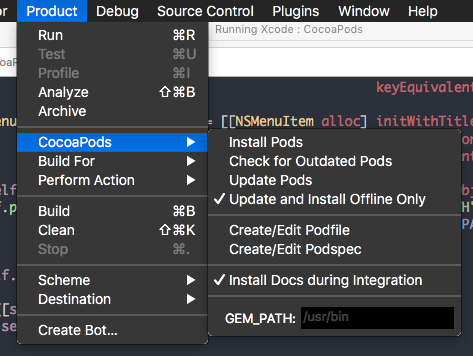

# Xcode开发必备-优秀插件分享
 
----
##CocoaPods 插件 cocoapods-xcode-plugin

- 我很不喜欢用终端设置 CocoaPods，所以站在巨人的肩膀上用了这个插件，非常好用哦!
 - https://github.com/kattrali/cocoapods-xcode-plugin

##快速写代码注释的插件 VVDocumenter-Xcode
- 平时经常使用的，有些依赖她了。
 - https://github.com/onevcat/VVDocumenter-Xcode
 
 
(演示动画 Gif 图片加载中，请耐心等待)

##快速查看并选取Xcode图片资源-KSImageNamed-Xcode

- 使用方便，敲代码的时候就可以直观查看和选择项目图片资源，不需要再切来换去找图片了
  - https://github.com/ksuther/KSImageNamed-Xcode

##快速建模工具 ESJsonFormat-Xcode
- 很强悍哦！将 JSON 格式化输出为模型的属性，还能生成生成的 MJExtension 框架中objectClassInArray方法(类方法)
 - https://github.com/EnjoySR/ESJsonFormat-Xcode

(演示动画 Gif 图片加载中，请耐心等待)

##日志框架 CocoaLumberjack
- CocoaLumberjack是Mac和iOS上一个集快捷、简单、强大和灵活于一身的日志框架。CocoaLumberjack类似于流行的日志框架（如log4j），但它是专为Objective-C设计的，利用了多线程、GCD（如果可用）、无锁原子操作Objective-C运行时的动态特性。
  - 作者源代码： https://github.com/CocoaLumberjack/CocoaLumberjack
  - 相关中文资料：http://www.cocoachina.com/industry/20140414/8157.html

##让你的日志变成彩色的 XcodeColors
- 很有趣的插件，可以试一下哦~
  - 作者源代码： https://github.com/DeepIT/XcodeColors

