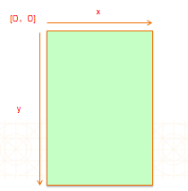

# Frame和Bounds及尺寸位置
 
---
```objc
Update更新：2016年5月23日 By {MISSAJJ琴瑟静听}
```
###UIKit坐标系


```objc
在UIKit中，坐标系的原点(0，0)在左上角，x值向右正向延伸，y值向下正向延伸

```



- frame
    - 以`父控件` `内容`的左上角为坐标原点, 计算出的`控件自己` `矩形框`的位置和尺寸
- bounds
    - 以`控件自己` `内容`的左上角为坐标原点, 计算出的`控件自己` `矩形框`的位置和尺寸
- 概括
    - frame.size == bounds.size
    - scrollView.bounds.origin == scrollView.contentOffset

## bounds和frame的区别


## 矩形框和内容的理解
- 矩形框
    - 控件自己的显示位置和尺寸
- 内容
    - 控件内部的东西,比如它的子控件


## 矩形框比较的2个函数
- bool CGRectContainsRect(CGRect rect1, CGRect rect2)
    - 判断rect1是否包含了rect2
- bool CGRectIntersectsRect(CGRect rect1, CGRect rect2)
    - 判断rect1和rect2是否有重叠
    - `注意：rect1和rect2要在同一个坐标系，比较结果才准确`

## 转换坐标系总结
```objc
view2坐标系 : 以view2的左上角为坐标原点
view1坐标系 : 以view1的左上角为坐标原点

CGRect newRect = [view1 convertRect:rect fromView:view2];
// 让rect这个矩形框， 从view2坐标系转换到view1坐标系, 得出一个新的矩形框newRect
// rect和view2的含义 ： 用来确定矩形框原来在哪

CGRect newRect = [view1 convertRect:rect toView:view2];
// 让rect这个矩形框， 从view1坐标系转换到view2坐标系, 得出一个新的矩形框newRect
// rect和view1的含义 ：用来确定矩形框原来在哪
```

## 获得一个控件在window中的位置和尺寸
- 以获得redView在window中的位置和尺寸为例

```objc
CGRect newRect = [[UIApplication sharedApplication].keyWindow convertRect:redView.bounds fromView:redView];
CGRect newRect = [[UIApplication sharedApplication].keyWindow convertRect:redView.frame fromView:redView.superview];
CGRect newRect = [redView convertRect:redView.bounds toView:[UIApplication sharedApplication].keyWindow];
CGRect newRect = [redView.superview convertRect:redView.frame toView:[UIApplication sharedApplication].keyWindow];
CGRect newRect = [redView convertRect:redView.bounds toView:nil];
CGRect newRect = [redView.superview convertRect:redView.frame toView:nil];
```

## center和size的设置顺序
- 建议的设置顺序
    - 先设置size
    - 再设置center

## 给系统自带的类增加分类
- 建议增加的分类属性名\方法名前面加上前缀, 比如

```objc
@interface UIView (XMGExtension)
@property (nonatomic, assign) CGFloat xmg_width;
@property (nonatomic, assign) CGFloat xmg_height;
@property (nonatomic, assign) CGFloat xmg_x;
@property (nonatomic, assign) CGFloat xmg_y;
@property (nonatomic, assign) CGFloat xmg_centerX;
@property (nonatomic, assign) CGFloat xmg_centerY;

@property (nonatomic, assign) CGFloat xmg_right;
@property (nonatomic, assign) CGFloat xmg_bottom;
@end
```